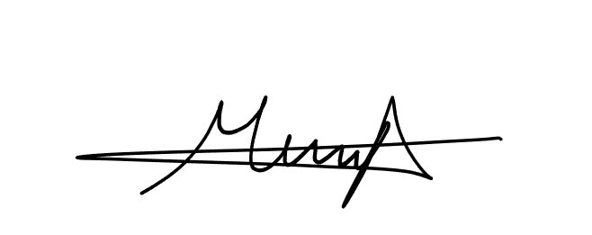
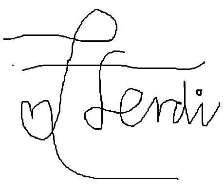

# Deklarasi Penggunaan AI

## Tugas Besar IF2150 - Rekayasa Perangkat Lunak

| Informasi | Keterangan |
|---|---|
| Kelas | *02* |
| Nomor Kelompok | *10* |
| Nama Kelompok | *RPL at 25* |
| Nama Perangkat Lunak | *[Nama P/L]* |

**Anggota Kelompok:**

| NIM | Nama |
|---|---|
| *13525083* | *Natanael Chris Fabian Santoso* |
| *13525131* | *Mirza Aryasatya Akmal* |
| *13525149* | *Ferdinand Valentino Darmawan* |
| *13525050* | *Jason Hartanto* |
| *13525065* | *Christopher Hendrik Gunawan* |

---

### Daftar Isi
* [Milestone 1](#milestone-1)
* Notes: Copy bagian Daftar Isi seperti Milestone 1 untuk Milestone berikutnya, contoh ``* [Milestone 2](#milestone-2)``. Ketika Daftar isi diklik maka akan langsung diarahkan ke bagian bawah sesuai dengan Milestone tujuan.

---

### Log Penggunaan AI per Milestone

Silakan catat penggunaan AI yang berdampak signifikan pada pengerjaan tugas (misal: *generate* fungsi algoritma yang kompleks, *generate* draf dokumen SKPL/DPPL, atau *debugging* error utama). 
*Penggunaan sepele seperti memperbaiki *typo* atau auto-complete satu baris kode tidak perlu dicatat.*

### Milestone 1
| Tool AI | Tujuan Penggunaan | Contoh Prompt Utama | Modifikasi & Validasi Manusia |
| :--- | :--- | :--- | :--- |
| *[Nama AI]* | *[Sertakan Tujuan Penggunaan]* | *[Tuliskan Prompt Utama]* | *[Tuliskan Keputusan Hasil Validasi]* |
| *Gemini* | *Menentukkan fokus utama pada 9 fokus utama pada SDG 5* | *Pertanyaan awal untuk mengetahui 9 fokus utama pada SDG 5 dengan follow-up question untuk menentukkan mana yang paling harus diselesaikkan terlebih dahulu diIndonesia* | *AI memberi tahu bahwa poin tujuan ke2 merupakan poin dari SDG 5 yang harus diselesaikan terlebih dahulu diIndonesia, setelah melihat banyaknya berita dan data beredar mengenai poin tersebut kami memutuskan bahwa poin tersebut benar benar penting untuk dilihat lebih lanjut diIndonesia* |
| | | | | |

### Milestone 2
| Tool AI | Tujuan Penggunaan | Contoh Prompt Utama | Modifikasi & Validasi Manusia |
| :--- | :--- | :--- | :--- |
| | | | | |
| | | | | |

---
### Pernyataan Integritas dan Persetujuan

Kami yang bertanda tangan di bawah ini menyatakan bahwa seluruh log penggunaan AI di atas adalah benar. Kami telah memvalidasi seluruh hasil AI dan bertanggung jawab penuh atas orisinalitas, keamanan, dan kebenaran hasil akhir dari tugas ini.

| Tanda Tangan | Nama Anggota |
| :---: | :--- |
|  | **[NIM - Nama Anggota 1]** |
|  | **[NIM - Nama Anggota 2]** |
|  | **[NIM - Nama Anggota 3]** |
|  | **[NIM - Nama Anggota 4]** |
|  | **[NIM - Nama Anggota 5]** |