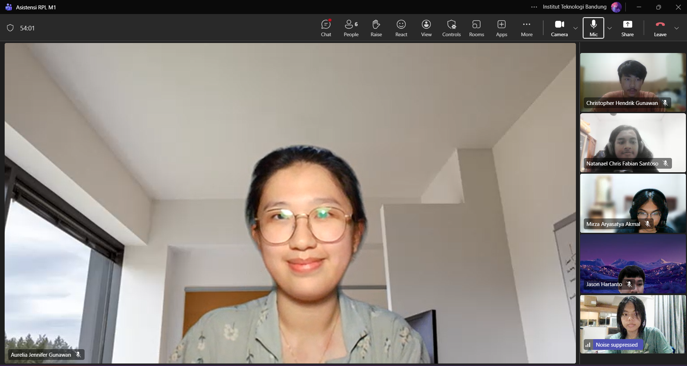

# Form Asistensi

## Tugas Besar IF2150 - Rekayasa Perangkat Lunak

| Informasi | Keterangan |
| --- | --- |
| **Hari** | *Selasa* |
| **Tanggal** | *01/09/2026* |
| **Kelas** | *02* |
| **Nomor Kelompok** | *10*  |
| **Nama Kelompok** | *RPL at 25*  |
| **Nama Perangkat Lunak** | *SafeShe*  |
| **Dokumen** | *K02_G10_TB*  |

### Anggota Kelompok

| NIM | Nama |
| --- | --- |
| *13525083* | *Natanael Chris Fabian Santoso* |
| *13525131* | *Mirza Aryasatya Akmal* |
| *13525149* | *Ferdinand Valentino Darmawan* |
| *13525050* | *Jason Hartanto* |
| *13525065* | *Christopher Hendrik Gunawan* |

### Catatan

| Catatan |
| --- |
| 1. Kritik ke penulisan, kalau singkatan dalam kurung tidak apa-apa, tetapi selain itu perlu menggunakan bridging yang lebih baik untuk penulisan kalimat, secara general untuk konten di bab 1. |
| 2. Cantumkan referensi artikel yang digunakan sebagai sumber. |
| 3. Buat poin-poin di sistem menjadi paragraf saja. |
| 4. Jelaskan juga kesenjangan yang dimaksud ketika menampilkan kesenjangan yang ada. |
| 5. Penulisan diperbaiki agar awalnya di bab 2 lebih baik. |
| 6. Tidak perlu menulis batasan waktu, 2 kalimat terakhir di bab 2.2 disatukan saja, agar lebih tegas. |
| 7. Tambah paragraf baru untuk asumsi, buat paragraf pertama menjadi asumsi dan kedua menjadi batasan. Asumsi akan lebih fokus ke sisi pengguna. |
| 8. Untuk bab 3, polisi sebagai aktor. Polisi dapat memberikan notifikasi balik telah merespons SOS, dapat ditambahkan dengan fitur notifikasi yang unik untuk aplikasi agar tidak mudah terdeteksi. |
| 9. Aktor adalah pengguna utama aplikasi, jadi server penyedia informasi saja tidak termasuk aktor. |
| 10. Untuk identifikasi aktor, 2 saja sudah cukup, 3 agak banyak tetapi boleh asalkan dapat diurus. | 
| 11. Kebutuhan pengguna awal dibuat berdasarkan identifikasi aktor dari bagian sebelumnya. |
| 12. Deskripsi aktivitas adalah penguraian dari kebutuhan pengguna awal, jadi apa yang harus aplikasi bisa fasilitasi agar kebutuhan awal pengguna dapat terpenuhi. |
| 13. Activity Diagram itu dibuat berdasarkan deskripsi aktivitas, tidak harus terlalu detail sampai teknisnya. Swimline program akan ada 3 lane, 1 untuk aktor korban, 1 untuk aktor polisi, dan 1 untuk sistem. Tujuannya agar terlihat bagaimana aktor berinteraksi dengan sistem, dari pihak sistem tidak perlu terlalu teknis karena akan bertabrakan dengan milestone berikutnya. Juga kasih link untuk di mana pembuatan diagramnya. Juga pembuatan diagram harus rapi dari garis-garisnya sebab layout diagram akan dinilai. Setiap aktivitas yang terdapat di 3.3 perlu ada dalam swimlane diagram. Untuk diagramnya, boleh digabung satu yang besar untuk semua aktivitas atau boleh dipisah untuk sesuai dengan aktivitasnya. |
| 14. Di Logbook untuk durasi dalam jam, dapat dikira-kira saja jadi tidak perlu terlalu akurat. Tanggalnya itu tanggal mulai pengerjaan. |
| 15. Tidak ada ketentuan untuk release, asalkan ikuti saja formatnya. Juga hanya akan dilihat dari release terakhir untuk final. |

**Notes for this section:**  
*Catatan dapat dituliskan dalam bentuk paragraf atau poin-poin, disesuaikan saja.* 

## Dokumentasi

<!--  -->

  

  <i>Gambar 1. Dokumentasi kegiatan asistensi.</i>

