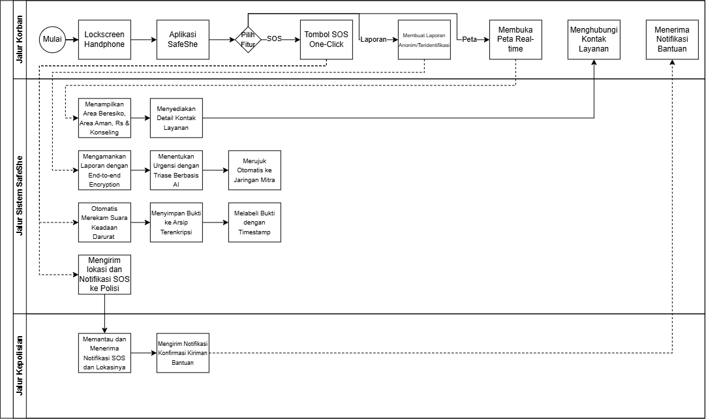

# BAB 3: Spesifikasi Kebutuhan dan Proses Bisnis

## 3.1 Identifikasi Aktor
Buatlah daftar seluruh aktor (pengguna) yang akan berinteraksi langsung dengan sistem solusi yang kalian kembangkan. Berikan penjelasan singkat mengenai peran dan karakteristik dari masing-masing aktor tersebut.

| Aktor | Deskripsi |
| :--- | :--- |
| Korban | Pengguna ini bertindak sebagai pihak yang memerlukan bantuan karena telah mengalami kekerasan seksual. Karakteristik dari pengguna ini adalah mengutamakan keamanan, kecepatan, dan konfirmasi respons untuk bantuan dari pihak kepolisian. |
| Polisi | Pengguna ini bertindak sebagai pihak yang memantau notifikasi SOS yang dikirimkan oleh korban. Karakteristik dari pengguna ini adalah menginginkan lokasi korban untuk memberi bantuan, mendapatkan bukti untuk membantu pembuatan kasus terhadap pelaku kekerasan seksual, serta kemampuan untuk mengirimkan notifikasi kembali kepada korban bahwa SOS telah diterima dan bantuan sedang dalam perjalanan. |

## 3.2 Kebutuhan Pengguna Awal
Definisikan apa yang ingin dicapai oleh pengguna saat menggunakan sistem ini dalam format *User Story* (Sebagai [Aktor], saya ingin [Aktivitas/Kebutuhan], sehingga [Tujuan/Nilai]). Pastikan kalian berfokus pada "apa yang ingin dilakukan pengguna".

| ID | Aktor | Kebutuhan / Aktivitas | Tujuan / Nilai |
| :--- | :--- | :--- | :--- |
| US-01 | *Korban* |  *Melapor kekerasan secara nyaman, anonim, dan diam-diam* | *Proses pelaporan reliable dan pelaku tidak mengetahui akan laporan* |
| US-02 | *Polisi* | *Menerima laporan dengan data deskripsi kejadian, lokasi, dan waktu kejadian yang akurat* | *Data yang diterima lengkap agar dapat mengklasifikasi urgensi kasus dan bertindak sebagaimana mestinya* |
| ... | ... | ... | ... |

## 3.3 Deskripsi Aktivitas
Buatlah daftar seluruh aktivitas yang terdapat dalam sistem solusi, lengkap dengan ID dan penjelasan. Telusuri hubungan aktivitas tersebut dengan *user story* yang sudah dituliskan sebelumnya. Bisa dibuat dalam bentuk tabel.
| ID | Aktivitas | Penjelasan | ID User Story |
| :--- | :--- | :--- | :--- |
| A01 | *Melakukan Pemesanan* | *Pelanggan memulai proses dengan memesan produk.* | *US-01* |
| A02 | *Memproses Pesanan* | *Sistem memproses dan menyiapkan detail sesuai dengan pesanan.* | *US-02*|
| ... | ... | ... | ... |

## 3.4 Model Proses Bisnis
 

<i>Gambar 1. Swimline Diagram SafeShe</i>

 