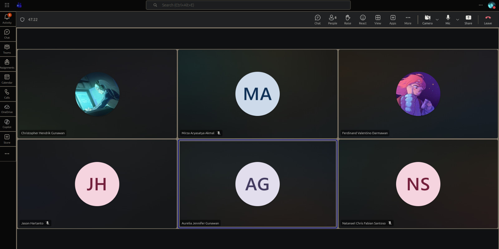

# Form Asistensi

## Tugas Besar IF2150 - Rekayasa Perangkat Lunak

| Informasi | Keterangan |
| --- | --- |
| **Hari** | *Selasa* |
| **Tanggal** | *08/09/2026* |
| **Kelas** | *02* |
| **Nomor Kelompok** | *10*  |
| **Nama Kelompok** | *RPL at 25*  |
| **Nama Perangkat Lunak** | *SafeShe*  |
| **Dokumen** | *K02_G10_RG*  |

### Anggota Kelompok

| NIM | Nama |
| --- | --- |
| *13525083* | *Natanael Chris Fabian Santoso* |
| *13525131* | *Mirza Aryasatya Akmal* |
| *13525149* | *Ferdinand Valentino Darmawan* |
| *13525050* | *Jason Hartanto* |
| *13525065* | *Christopher Hendrik Gunawan* |

### Catatan

| Catatan |
| --- |
| 1. Bab 1 kalau sudah memenuhi spesifikasi, bisa copy dari milestone 1.  |
| 2. Untuk US-03 dipecah menjadi melihat kontak layanan terdekat dan menjadi mengontak layanan yang tersedia. Dipecah jadi US-03 memiliki ID A03 dan A04. Totalnya jadi ada sampai A08. Revisi ini tambahkan di daftar perubahan. |
| 3. Di 2.3 itu deskripsi kebutuhan secara umum. Kebutuhan fungsional akan memperjelas secara perangkat lunaknya untuk memenuhi sebuah kebutuhan. Kalau kebutuhan non-fungsional, contoh deskripsi untuk availability sudah valid, jadi bisa mengikuti polanya. Kebutuhan fungsional itu POV nya perangkat lunak, kalau kebutuhan non-fungsional itu tergantung POV nya, bisa dari sistem, user, legal, jadi dapat bervariasi. Kebutuhan non-fungsional mendukung fitur utama. |
| 4. Sebuah kebutuhan dapat dibagi menjadi kebutuhan fungsional dan non-fungsional. Jadi di kebutuhan fungsional lebih ke fiturnya dan kebutuhan non-fungsional lebih ke deskripsi yang perlu dicapai fiturnya. |
| 5. Dari 8 parameter di kebutuhan non-fungsional, disarankan ada 1 contoh untuk setiap parameternya. Jika ingin dari sumber parameter lainnya untuk membantu, itu boleh. Batasannya itu di belasan saja, jangan sampai 20 yang terlalu banyak. Jadi tidak ada batasan maksimal yang ditetapkan dari awal. |
| 6. Parameter itu dipakai agar kebutuhan fungsional tidak terlalu abstrak dan measurable, agar ada sesuatu yang dapat dinilai. |
| 7. Seharusnya jenis kebutuhan itu hanya 3, ada bisnis, user, dan sistem. Legal itu dimasukkan saja ke jenis bisnis. |
| 8. Deskripsi kebutuhan itu gunakan format EARS (Easy Approach to Requirements Syntax), digunakan dari 2.3 sampai 2.5. |
| 9. Tambahkan US- berapa yang ditambahkan di Milestone 2 dibandingkan dengan Milestone 1 untuk daftar perubahan revisi A. |
| 10. Tambahkan revisi B untuk menjelaskan pengisian deskripsi aktivitas dari yang sebelumnya tidak ada di Milestone 1. |

  

  <i>Gambar 1. Dokumentasi kegiatan asistensi.</i>

