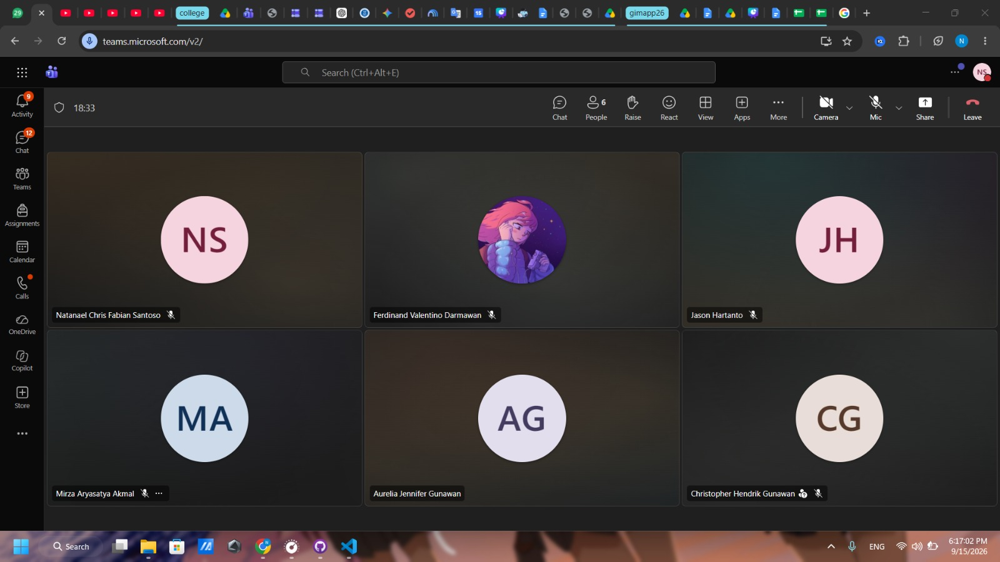

# Form Asistensi

## Tugas Besar IF2150 - Rekayasa Perangkat Lunak

| Informasi | Keterangan |
| --- | --- |
| **Hari** | *Selasa* |
| **Tanggal** | *08/09/2026* |
| **Kelas** | *02* |
| **Nomor Kelompok** | *10*  |
| **Nama Kelompok** | *RPL at 25*  |
| **Nama Perangkat Lunak** | *SafeShe*  |
| **Dokumen** | *K02_G10_UC*  |

### Anggota Kelompok

| NIM | Nama |
| --- | --- |
| *13525083* | *Natanael Chris Fabian Santoso* |
| *13525131* | *Mirza Aryasatya Akmal* |
| *13525149* | *Ferdinand Valentino Darmawan* |
| *13525050* | *Jason Hartanto* |
| *13525065* | *Christopher Hendrik Gunawan* |

### Catatan

| Catatan |
| --- |
| 1. Aktor penyedia layanan tidak perlu ditambahkan karena penyedia layanan tidak langsung berinteraksi langsung dengan aplikasi  |
| 2. Use case dipecah-pecah, jadi khusus dari fungsi SOS itu dapat dipecah lebih detail dibandingkan jadi hanya 1 use case besar saja |
| 3. Contoh diagram itu salah, itu exclude tapi harusnya extend. Aktor itu pengguna utama, pastikan ada extend dan include agar kelihat interaksinya |
| 4. Use case yang layanan dan kontak sudah bagus dipecah. Bisa ditambahkan juga use case menjadi korban melihat peta layanan terdekat, lalu korban memilih layanan, lalu korban mengontak layanan. |

**Notes for this section:**  
*Catatan dapat dituliskan dalam bentuk paragraf atau poin-poin, disesuaikan saja.* 

## Dokumentasi

<!--  -->

  

  <i>Gambar 1. Dokumentasi kegiatan asistensi.</i>

