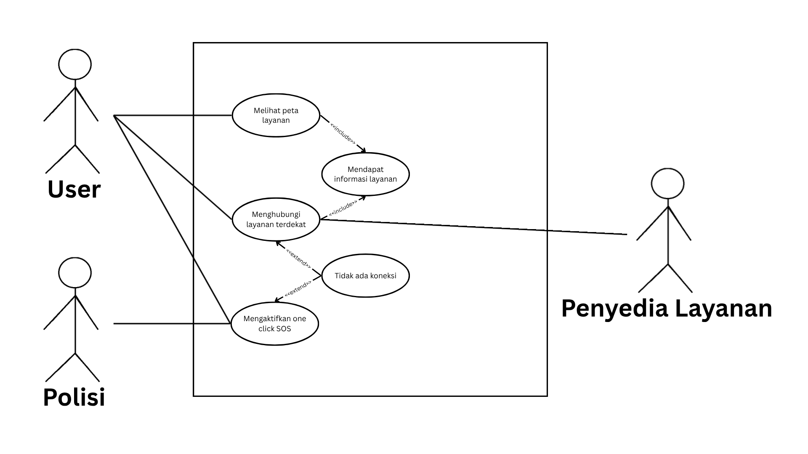

<h1>
IF2150 REKAYASA PERANGKAT LUNAK
 
TUGAS 4
 
CLASS DIAGRAM
</h1>
 

## *SafeShe*

### Untuk: *Aurelia Jennifer Gunawan*

Dipersiapkan oleh:
| Informasi | Keterangan |
| --- | --- |
| Kelas | *K2* |
| Kelompok | *10*  |

| NIM | Nama |
|---|---|
| *13525083* | *Natanael Chris Fabian Santoso* |
| *13525131* | *Mirza Aryasatya Akmal* |
| *13525149* | *Ferdinand Valentino Darmawan* |
| *13525050* | *Jason Hartanto* |
| *13525065* | *Christopher Hendrik Gunawan* |
---

## Daftar Perubahan

| Revisi | Deskripsi |
| :--- | :--- |
| *A* | *Menghapus aktor Penyedia Layanan dari 3.1* |
| *B* |  |
| *C* |  |
| ... |  |

 
 

# BAB 1: Deskripsi Perangkat Lunak

Fitur utama yang disediakan oleh aplikasi SafeShe adalah pelaporan anonim melalui *one-click SOS*. Fitur ini akan mengirimkan waktu dikirimnya dan lokasi korban ke pihak kepolisian yang anonim dan dapat dilakukan secara diam-diam. Fitur ini disertai dengan opsi untuk menambahkan tombol fitur ini melalui *widget* di handphone korban. Tujuannya dari penerapan fitur ini adalah untuk memudahkan korban membuat laporan yang tidak mudah terdeteksi oleh pelaku kekerasan. Ketika fitur ini dijalankan, handphone akan merekam suara sampai pihak kepolisian sampai di lokasi korban untuk membantu menangani kejadiannya. Tujuannya adalah untuk mendapatkan bukti kekerasan yang lebih konkrit dan dapat digunakan untuk membantu membuat kasus terhadap pelaku kekerasan yang akan ditangani oleh pihak kepolisian.

Selain itu, aplikasi memiliki fitur untuk menampilkan peta *real-time* yang akan menampilkan layanan rumah sakit dan konseling yang terdekat bagi pengguna melalui simbol-simbol yang terdapat di peta. Korban juga dapat mendapatkan informasi kontak dari layanan dan dapat menghubunginya melalui aplikasi yang akan memasukkan nomor telepon ke aplikasi telepon pada handphone. Tujuan dari fitur ini adalah untuk menyediakan bantuan yang mudah dicari dan diakses oleh korban setelah terjadinya kejadian kekerasan.

Lalu pihak kepolisian yang menerima laporan dari aplikasi akan menerima waktu terkirimnya SOS dan lokasi real-time dari handphone korban. Pihak kepolisian dapat melihat sebuah peta dari lokasinya korban selama pihak kepolisian belum sampai di lokasi korban. Setelah pihak kepolisian sudah sampai di lokasi korban, pihak kepolisian dapat mematikan SOS dan aplikasi akan berhenti mengirimkan lokasi real-time korban. Tujuan dari penerapannya adalah untuk memastikan agar pihak kepolisian dapat terus memantau lokasi asli korban selama belum sampai di lokasi korban dan menangani situasi yang terjadi.

Setelah SOS dimatikan, pihak kepolisian juga akan menerima rekaman suara kejadian yang terjadi melalui aplikasi setelah korban mengirimkan SOS. Tujuannya adalah untuk memudahkan pihak kepolisian mendapatkan bukti yang konkrit untuk menangani dan membuat kasus terhadap pelaku kekerasan. 

---

# BAB 2: Kebutuhan Fungsional

## 2.1 Kebutuhan Fungsional

Salin ulang seluruh Kebutuhan Fungsional (KF) yang telah dirumuskan pada dokumen sebelumnya, lengkap dengan ID KF, ID Kebutuhan (mengacu ke ID pada tabel Pemetaan Kebutuhan di dokumen *Requirement Gathering*), dan penjelasannya.

Pada bagian ini, Anda diperbolehkan untuk menyalin dari dokumen sebelumnya.

 ***Catatan***: *Kebutuhan ditulis mengikuti pola EARS. Pada contoh di bawah, sebagian besar KF dipicu oleh satu aksi pelanggan, sehingga memakai pola event-driven "Ketika ⟨pemicu⟩, sistem harus ⟨respons⟩".*

Tabel 2.1. Daftar Kebutuhan Fungsional

| ID KF | ID Kebutuhan | Penjelasan |
| :--- | :--- | :--- |
| *KF01* | *R01* | *Diberikan perangkat user memiliki fitur widget, ketika Peragkat Lunak diaktifkan, maka sistem menampilkan sebuah tombol one click SOS dalam bentuk widget aplikasi yang selalu ditampilkan di layar perangkat ketika perangkat aktif dan terbuka (tidak di-lock).* |
| *KF02* | *R02* | *Ketika user melakukan pelaporan, sistem akan bekerja tanpa membuat perangkat user bersuara atau bergetar agar tidak diketahui pelaku kekerasan.* |
| *KF03* | *R04* | *Ketika laporan awal dibuat, sistem akan mengenkripsi laporan tersebut secara end-to-end dan menyimpannya menggunakan blockchain-based timestamp.* |
| *KF04* | *R05* | *Ketika perangkat user dalam kondisi mati atau terkunci, sistem akan menyembunyikan tombol one click SOS dalam bentuk widget aplikasi agar tidak dapat ditekan secara tidak sengaja.* |
| *KF05* | *R06* | *Ketika user menekan tombol untuk menampilkan peta live, sistem akan menampilkan di seluruh layar sebuah peta live yang menampilkan fasilitas layanan terdekat, seperti rumah sakit, tempat konseling, dan area beresiko tinggi.* |
| *KF06* | *R07* | *Diberikan terdapat API yang dapat menampilkan data lokasi rumah sakit dan tempat konseling, ketika sistem akan menampilkan peta live kepada user, sistem akan memanggil API tersebut untuk memperoleh data lokasi rumah sakit dan tempat konseling yang akurat.* |
| *KF07* | *R09* | *Diberikan perangkat user memiliki sebuah mikrofon, ketika tombol one click SOS ditekan, sistem akan langsung mengaktifkan mikrofon perangkat user untuk merekam suara dalam keadaan darurat.* |
| *KF08* | *R11* | *Ketika pihak kepolisian mengirimkan notifikasi kepada sistem sebagai wujud konfirmasi kepada korban, sistem akan menerima notifikasi tersebut dan menampilkan notifikasi tersebut di layar perangkat korban.* |

---

# BAB 3: Model Use Case

## 3.1 Identifikasi Aktor

Tuliskan kembali daftar aktor yang terlibat dan deskripsi perannya dalam perangkat lunak (P/L). Deskripsi peran harus menjelaskan wewenang aktor tersebut dalam perangkat lunak. Perlu diingat bahwa aktor yang dimaksud adalah pengguna yang berinteraksi langsung dengan P/L. Komponen seperti database, payment gateway, atau library bukan aktor.

Pada bagian ini, Anda diperbolehkan untuk menyalin dari dokumen sebelumnya.

| Aktor | Deskripsi |
| :--- | :--- |
| *Korban* | *Pengguna ini bertindak sebagai pihak yang memerlukan bantuan karena telah mengalami kekerasan seksual. Karakteristik dari pengguna ini adalah mengutamakan keamanan, kecepatan, dan konfirmasi respons untuk bantuan dari pihak kepolisian.* |
| *Polisi* | *Pengguna ini bertindak sebagai pihak yang memantau notifikasi SOS yang dikirimkan oleh korban. Karakteristik dari pengguna ini adalah menginginkan lokasi korban untuk memberi bantuan, mendapatkan bukti untuk membantu pembuatan kasus terhadap pelaku kekerasan seksual, serta kemampuan untuk mengirimkan notifikasi kembali kepada korban bahwa SOS telah diterima dan bantuan sedang dalam perjalanan.* |

## 3.2 Identifikasi Use Case

Use case berfungsi untuk mendeskripsikan interaksi aktor-aktor yang terlibat dengan sistem. Isi daftar use case dan deskripsi singkatnya dalam tabel di bawah.

Pada bagian ini, Anda diperbolehkan untuk menyalin dari dokumen sebelumnya.

| ID UC | Nama Use Case | Deskripsi Singkat | Aktor | ID KF |
| :--- | :--- | :--- | :--- | :--- |
| *UC01* | *Mengaktifkan one click SOS* | *Korban menekan tombol SOS untuk mengirimkan laporan dan lokasi dengan cepat, sistem otomatis mulai merekam suara, polisi akan mengupdate status laoran setelah menapatkan laporannya* | *Korban, Polisi* | *KF01,KF02,KF03,KF04,KF07,KF08* |
| *UC02* | *Melihat Peta Layanan Terdekat* | *Korban membuka peta yang menampilkan fasilitas layanan terdekat* | *Korban* | *KF05, KF06* |
| *UC03* | *Memilih Layanan Terdekat* | *Korban memilih layanan terdekat dengan menekan simbol fasilitas* | *Korban* | *KF05, KF06* |
| *UC04* | *Menghubungi Layanan Terdekat* | *Korban melihat informasi kontak fasilitas layanan pada peta dan dapat menghubungi secara langsung melalui aplikasi* | *Korban, Penyedia layanan* | *KFxxx* |
| *UC05* | *Membuat Laporan Kekerasan* | *Korban melakukan pelaporan tindakan kekerasan melalui form dengan opsi anonim/teridentifikasi yang kemudian diproses sistem* | *Korban, Penyedia layanan* | *KF* |
| *UC06* | *Merekam Suara Otomatis Ketika One Click SOS Diaktifkan* | *Sistem menyalakan mikrofon gawai korban secara otomatis ketika One Click SOS Diaktifkan* | *Korban* | *KF* |
| *UC07* | *Mengirim Notifikasi Konfirmasi Polisi Ke Korban* | *Sistem mengirimkan notifikasi kepada korban ketika polisi menerima informasi keadaan darurat dan mengonfirmasi hal tersebut* | *Korban, Polisi* | *KF* |

## 3.3 Use Case Diagram
Buatlah diagram use case keseluruhan berdasarkan identifikasi use case beserta aktor yang melakukan use case tersebut. Perhatikan garis `<<extend>>` dan `<<include>>`.

Pada bagian ini, Anda diperbolehkan untuk menyalin dari dokumen sebelumnya.

 

<i>Gambar 1. Use Case Diagram</i>

 

## 3.4 Skenario Use Case
Salin ulang skenario **setiap** use case (skenario normal dan alternatif) dari dokumen *Use Case & Scenario Use Case*. Skenario ini menjadi dasar penentuan atribut dan metode/operasi kelas pada BAB 4.

Pada bagian ini, Anda diperbolehkan untuk menyalin dari dokumen sebelumnya.

### 3.4.1 Skenario UC01

**Nama Use Case:** *Melakukan Pembayaran Digital*

**Skenario Normal**

| No | Aksi Aktor | Reaksi Perangkat Lunak |
| :--- | :--- | :--- |
| 1 | *Pelanggan memilih menu checkout* | *Sistem menampilkan ringkasan pesanan dan pilihan metode pembayaran* |
| 2 | *Pelanggan memilih metode pembayaran (misal: e-wallet)* | *Sistem mengarahkan pelanggan ke halaman konfirmasi e-wallet* |

 

**Skenario Alternatif 1: Otorisasi Pembayaran Gagal**

| No | Aksi Aktor | Reaksi Perangkat Lunak |
| :--- | :--- | :--- |
| 1 | *Korban merasa terancam dan menyalakan device untuk menekan One Click SOS aplikasi SafeShe* | *Sistem menampilkan tombol One Click SOS dalam bentuk widget aplikasi ketika gawai korban dinyalakan dan dibuka (tidak di-lock)* |
| 2 | *Korban menekan tombol One Click SOS via widget aplikasi* | *Tanpa bersuara, sistem menampilkan animasi tombol ditekan, lalu mencoba mengirimkan informasi terkait keadaan darurat korban sekarang ke pihak berwajib, tetapi informasi gagal dikirimkan* |
| 3 | *Korban menunggu konfirmasi kegagalan sistem* | *Sistem mengirimkan notifikasi gagal mengirimkan informasi ke pihak berwajib. Sistem kembali ke langkah 2 skenario normal* |

### 3.4.2 Skenario UC02

**Nama Use Case:** *Melihat Peta Layanan Terdekat*

**Skenario Normal**

| No | Aksi Aktor | Reaksi Perangkat Lunak |
| :--- | :--- | :--- |
| 1 | *Korban menekan tombol peta* | *Sistem menampilkan peta live di sekitar lokasi korban* |
| 2 | *Korban menunggu beberapa detik* | *Sistem memanggil API yang berisi informasi layanan yang tersedia di sekitar lokasi korban dan menampilkan lokasi akurat layanan yang tersedia melalui simbol-simbol di peta* |

 

**Skenario Alternatif 1: API Tidak Dapat Dipanggil**

| No | Aksi Aktor | Reaksi Perangkat Lunak |
| :--- | :--- | :--- |
| 1 | *Korban menekan tombol peta* | *Sistem menampilkan peta live di sekitar lokasi korban* |
| 2 | *Korban menunggu beberapa detik* | *Sistem  memanggil API yang berisi informasi layanan yang tersedia di sekitar lokasi korban, tetapi API gagal untuk dipanggil* |
| 3 | *Korban melihat peta* | *Sistem tidak menampilkan simbol-simbol layanan yang tersedia karena tidak dapat mendapatkan informasi lokasi akurat dan nomor kontak layanan* |

### 3.4.3 Skenario UC03

**Nama Use Case:** *Memilih Layanan Terdekat*

**Skenario Normal**
| :--- | :--- | :--- |
| 1 | *Korban melihat layanan yang tersedia* | *Sistem memanggil API yang berisi informasi layanan yang tersedia di sekitar lokasi korban dan menampilkan lokasi akurat layanan yang tersedia melalui simbol-simbol di peta* |
| 2 | *Korban  memilih sebuah layanan dengan menekan simbol* | *Sistem menampilkan informasi lokasi dan nomor kontak layanan yang ditekan* |

**Skenario Alternatif 1: Informasi yang Dipanggil API Tidak Lengkap**

| No | Aksi Aktor | Reaksi Perangkat Lunak |
| :--- | :--- | :--- |
| 1 | *Korban melihat layanan yang tersedia* | *Sistem memanggil API yang berisi informasi layanan yang tersedia di sekitar lokasi korban dan menampilkan lokasi layanan yang tersedia melalui simbol-simbol di peta* |
| 3 | *Korban memilih sebuah layanan dengan menekan simbol* | *Sistem menampilkan informasi layanan tetapi tidak lengkap, antara hanya informasi lokasi atau nomor kontak layanan yang tersedia* |

### 3.4.4 Skenario UC04

**Nama Use Case:** *Memilih Layanan Terdekat*

**Skenario Normal**
| :--- | :--- | :--- |
| 1 | *Korban melihat layanan yang tersedia* | *Sistem memanggil API yang berisi informasi layanan yang tersedia di sekitar lokasi korban dan menampilkan lokasi akurat layanan yang tersedia melalui simbol-simbol di peta* |
| 2 | *Korban  memilih sebuah layanan dengan menekan simbol* | *Sistem menampilkan informasi lokasi dan nomor kontak layanan yang ditekan* |

**Skenario Alternatif 1: Informasi yang Dipanggil API Tidak Lengkap**

| No | Aksi Aktor | Reaksi Perangkat Lunak |
| :--- | :--- | :--- |
| 1 | *Korban melihat layanan yang tersedia* | *Sistem memanggil API yang berisi informasi layanan yang tersedia di sekitar lokasi korban dan menampilkan lokasi layanan yang tersedia melalui simbol-simbol di peta* |
| 3 | *Korban memilih sebuah layanan dengan menekan simbol* | *Sistem menampilkan informasi layanan tetapi tidak lengkap, antara hanya informasi lokasi atau nomor kontak layanan yang tersedia* |

### 3.4.5 Skenario UC05

**Nama Use Case:** *Menghubungi Layanan Terdekat*

**Skenario Normal**

| No | Aksi Aktor | Reaksi Perangkat Lunak |
| :--- | :--- | :--- |
| 1 | *Korban menekan tombol layanan pada peta* | *Sistem menampilkan informasi kontak layanan beserta tombol untuk menelepon* |
| 2 | *Korban menekan tombol telepon* | *Sistem membuka aplikasi telepon pada perangkat dan mengisi nomor telepon kontak secara otomatis* |

 

**Skenario Alternatif 1: Informasi Kontak Tidak Tersedia**

| No | Aksi Aktor | Reaksi Perangkat Lunak |
| :--- | :--- | :--- |
| 1 | *Korban menekan tombol layanan yang tidak memiliki nomor kontak* | *Sistem menampilkan informasi layanan tanpa tombol telepon dan memberi keterangan "Nomor kontak pada layanan ini belum tersedia"* |

### 3.4.6 Skenario UC06

**Nama Use Case:** *Merekam Suara Otomatis Ketika One Click SOS Diaktifkan*

**Skenario Normal**

| No | Aksi Aktor | Reaksi Perangkat Lunak |
| :--- | :--- | :--- |
| 1 | *Korban menekan tombol One Click SOS* | *Sistem mengikuti prosedur sesuai UC01 skenario normal* |
| 2 | *Korban menunggu konfirmasi mikrofon sudah diaktifkan* | *Sistem menyalakan mikrofon gawai dan mengirimkan notifikasi bahwa mikrofon berhasil dinyalakan dan sedang merekam* |

**Skenario Alternatif 1: Mikrofon Gawai Korban Tidak Dapat Diaktifkan**

| No | Aksi Aktor | Reaksi Perangkat Lunak |
| :--- | :--- | :--- |
| 1 | *Korban menekan tombol One Click SOS* | *Sistem mengikuti prosedur sesuai UC01 skenario normal* |
| 2 | *Korban menunggu konfirmasi mikrofon sudah diaktifkan* | *Sistem mencoba menyalakan mikrofon gawai tetapi gagal dan menampilkan notifikasi bahwa mikrofon gagal diaktifkan* |

### 3.4.7 Skenario UC07

**Nama Use Case:** *Mengirim Notifikasi Konfirmasi Polisi Ke Korban*

**Skenario Normal**

| No | Aksi Aktor | Reaksi Perangkat Lunak |
| :--- | :--- | :--- |
| 1 | *Polisi menunggu notifikasi informasi terkait kejadian darurat* | *Sistem mengirimkan notifikasi kepada polisi tentang kejadian darurat* |
| 2 | *Polisi menerima infomasi, lalu mengirimkan notifikasi konfirmasi kepada korban* | *Sistem meneruskan dan menampilkan notifikasi konfirmasi tersebut di gawai korban* |

**Skenario Alternatif 1: Kendala Jaringan dan Gagal Terhubung Ke Server**

| No | Aksi Aktor | Reaksi Perangkat Lunak |
| :--- | :--- | :--- |
| 1 | *Polisi menunggu notifikasi informasi terkait kejadian darurat* | *Sistem mengirimkan notifikasi kepada polisi tentang kejadian darurat* |
| 2 | *Polisi menerima infomasi, lalu mengirimkan notifikasi konfirmasi kepada korban* | *Karena kendala jaringan, sistem mengirimkan notifikasi bahwa notifikasi konfirmasi gagal dikirimkan. Lalu, melajutkan langkah ke langkah 2 skenario normal* |

---

# BAB 4: Diagram Kelas
Bagian ini berisi identifikasi kelas dan pemodelan struktur kelas yang diperlukan untuk merealisasikan use case pada BAB 3. Gunakan skenario use case (3.4) sebagai dasar untuk menentukan kelas, atribut, metode, dan hubungan antarkelas.

## 4.1 Identifikasi Kelas
Identifikasi seluruh kelas yang diperlukan berdasarkan use case dan skenarionya. Satu kelas boleh terkait dengan lebih dari satu use case.

| ID Kelas | Nama Kelas | Deskripsi Kelas | ID Use Case |
| :--- | :--- | :--- | :--- |
| *C01* | *Pelanggan* | *Menyimpan data akun pelanggan yang membuat pesanan.* | *UC01, UC05* |
| *C02* | *Pesanan* | *Menyimpan data pesanan beserta status pembayarannya.* | *UC01, UC03, UC05* |
| *C03* | *Keranjang* | *Menyimpan sementara item yang dipilih sebelum checkout.* | *UC01, UC02* |
| *C04* | *MetodePembayaran* | *Kelas abstrak yang merepresentasikan metode pembayaran yang dipilih pelanggan.* | *UC03, UC04* |
| *C05* | *Kartu* | *Merealisasikan pembayaran melalui kartu kredit/debit dengan mengirimkan permintaan ke payment gateway (dummy).* | *UC03, UC04* |
| *C06* | *EWallet* | *Merealisasikan pembayaran melalui e-wallet, termasuk pengecekan saldo, dengan mengirimkan permintaan ke payment gateway (dummy).* | *UC03, UC04* |
| *C07* | *RiwayatTransaksi* | *Menyimpan catatan transaksi beserta status yang dikembalikan payment gateway (dummy).* | *UC03, UC05* |
| *...* | *...* | *...* | *...* |

Pastikan setiap kelas memiliki tanggung jawab yang jelas dan memang diperlukan untuk merealisasikan fungsi yang dimodelkan. Hindari kelas yang tidak memiliki keterkaitan dengan KF atau use case manapun.

## 4.2 Diagram Kelas per Use Case
Buat diagram kelas untuk setiap use case pada 3.2.

### 4.2.1 Use Case UC01

**Nama Use Case:** *Memesan Produk*

#### Identifikasi Kelas

| ID Kelas | Nama Kelas | Deskripsi Kelas |
| :--- | :--- | :--- |
| *C01* | *Pelanggan* | *Menyimpan data akun pelanggan yang membuat pesanan.* |
| *C02* | *Pesanan* | *Menyimpan data pesanan yang dibuat dari isi keranjang.* |
| *C03* | *Keranjang* | *Menyimpan sementara item yang dipilih sebelum checkout.* |
| *...* | *...* | *...* |

#### Diagram Kelas

<i>Gambar 2. Diagram Kelas Use Case UC01</i>

 

Pada diagram kelas, cukup tampilkan nama kelas saja. Atribut dan metode/operasi milik setiap kelas dapat dituliskan pada tabel di bawah ini. Pastikan hubungan antarkelas menggunakan jenis relasi yang sesuai (asosiasi, agregasi, komposisi, generalisasi, atau dependensi).

| ID Kelas | Nama Kelas | Atribut | Metode/Operasi |
| :--- | :--- | :--- | :--- |
| *C02* | *Pesanan* | *idPesanan, total, status* | *buatPesanan(), hitungTotal()* |
| *C03* | *Keranjang* | *daftarItem* | *tambahItem(), checkout()* |
| *...* | *...* | *...* | *...* |

> Lanjutkan pola **4.2.x** untuk setiap use case pada 3.2.

## 4.3 Diagram Kelas Keseluruhan

Gabungkan seluruh kelas dan hubungan antarkelas dari diagram kelas setiap use case menjadi satu diagram kelas keseluruhan. Pastikan tidak ada kelas yang terduplikasi.

<i>Gambar X. Diagram Kelas Keseluruhan</i>

 

| ID Kelas | Nama Kelas | Atribut | Metode/Operasi |
| :--- | :--- | :--- | :--- |
| *C01* | *Pelanggan* | *idPelanggan, nama, email* | *lihatRiwayatPesanan()* |
| *C02* | *Pesanan* | *idPesanan, total, status* | *hitungTotal(), perbaruiStatus()* |
| *C03* | *Keranjang* | *daftarItem* | *tambahItem(), checkout()* |
| *C04* | *MetodePembayaran* | *-* | *kirimKePaymentGatewayDummy()* |
| *C05* | *Kartu* | *nomorKartu, masaBerlaku* | *kirimKePaymentGatewayDummy()* |
| *C06* | *EWallet* | *saldo, idAkun* | *cekSaldo(), kirimKePaymentGatewayDummy()* |
| *C07* | *RiwayatTransaksi* | *idTransaksi, waktu, status* | *catatTransaksi(), tampilkanNotifikasi()* |
| *...* | *...* | *...* | *...* |

---

# BAB 5: Traceability
Cocokkan setiap kebutuhan fungsional, use case, dengan diagram kelas yang mendukung atau mengimplementasikan kebutuhan tersebut.

| ID Kelas | ID Use Case | ID KF |
| :--- | :--- | :--- |
| *C01* | *UC01, UC05* | *KF01, KF06* |
| *C02* | *UC01, UC03, UC05* | *KF01, KF02, KF05, KF06* |
| *C03* | *UC01, UC02* | *KF01, KF02* |
| *C04* | *UC03, UC04* | *KF03* |
| *C05* | *UC03, UC04* | *KF03* |
| *C06* | *UC03, UC04* | *KF03, KF04* |
| *C07* | *UC03, UC05* | *KF04, KF05* |
| *...* | *...* | *...* |

---

# Referensi

- Diagram UML: [https://www.drawio.com/](https://www.drawio.com/), [https://staruml.io/](https://staruml.io/)