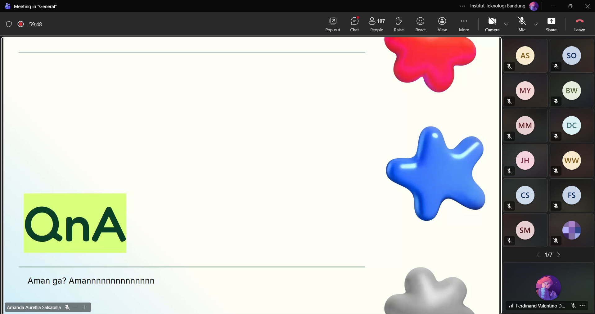

# Form Asistensi

## Tugas Besar IF2150 - Rekayasa Perangkat Lunak

| Informasi | Keterangan |
| --- | --- |
| **Hari** | *Jumat* |
| **Tanggal** | *18/09/2026* |
| **Kelas** | *02* |
| **Nomor Kelompok** | *10*  |
| **Nama Kelompok** | *RPL at 25*  |
| **Nama Perangkat Lunak** | *SafeShe*  |
| **Dokumen** | *K02_G10_UC*  |

### Anggota Kelompok

| NIM | Nama |
| --- | --- |
| *13525083* | *Natanael Chris Fabian Santoso* |
| *13525131* | *Mirza Aryasatya Akmal* |
| *13525149* | *Ferdinand Valentino Darmawan* |
| *13525050* | *Jason Hartanto* |
| *13525065* | *Christopher Hendrik Gunawan* |

### Catatan

| Catatan |
| --- |
| 1. Class diagram mempunyai kelas, metode, relasi dengan tujuan untuk merealisasikan skenario dari Milestone 3. |
| 2. Yang bagian deliverables 1, 2, dan 3 sudah dikerjakan di milestone sebelumnya asalkan sudah benar. |
| 3. Yang bagian kebutuhan fungsional kurang ID nya di template Milestone 3, dan kalau mau tambahkan, pastikan relate dengan yang dibutuhkan sistem. |
| 4. Aktor adalah user yang langsung berinteraksi dengan aplikasi, sistem third party dianggap bisa diotomasikan. |
| 5. Diagram kelas bukan berarti harus pakai paradigma OOP dalam pengimplementasian, karena mayoritas implementasi dalam bentuk website yang lebih fungsional. Di sini diagram kelas untuk mendefinisikan hubungan antarkelas dan tanggung jawabnya apa. |
| 6. Identifikasi kelas bisa ditelusuri dari setiap use case yang dimiliki, kelas-kelas dikembangkan berdasarkan preferensi masing-masing tetapi untuk mendefinisikan hubungan dan tanggung jawabnya, serta maintainibility ketika diimplementasikan. |
| 7. Controller yang menghubungkan ke user side jadi bisa seperti dalam bentuk API. |
| 8. Buat diagramnya per use case dulu dibandingkan memikirkan kelas dari seluruh use case sekaligus, setelah semuanya sudah dibuat diagramnya, baru dibuat diagram kelas. |
| 9. Di asosiasi, hubungan dari kelas 1 ke kelas 2, berarti kelas 1 menyimpan kelas 2 sebagai atributnya. Bedanya dengan dependensi adalah kelas 1 berarti cuma pakai kelas 2 saja, tidak menyimpan kelas 2. |
| 10. Untuk agregasi, kalau induknya hilang maka yang disimpannya hilang, sedangkan untuk komposisi, kalau induknya hilang maka yang disimpannya tidak hilang. |
| 11. Untuk toolsnya, bisa pakai draw.io, plantuml/staruml, mermaid, dan lucidchart/visual paradigm. |

**Notes for this section:**  
*Catatan dapat dituliskan dalam bentuk paragraf atau poin-poin, disesuaikan saja.* 

## Dokumentasi

<!--  -->

  

  <i>Gambar 1. Dokumentasi kegiatan asistensi.</i>

