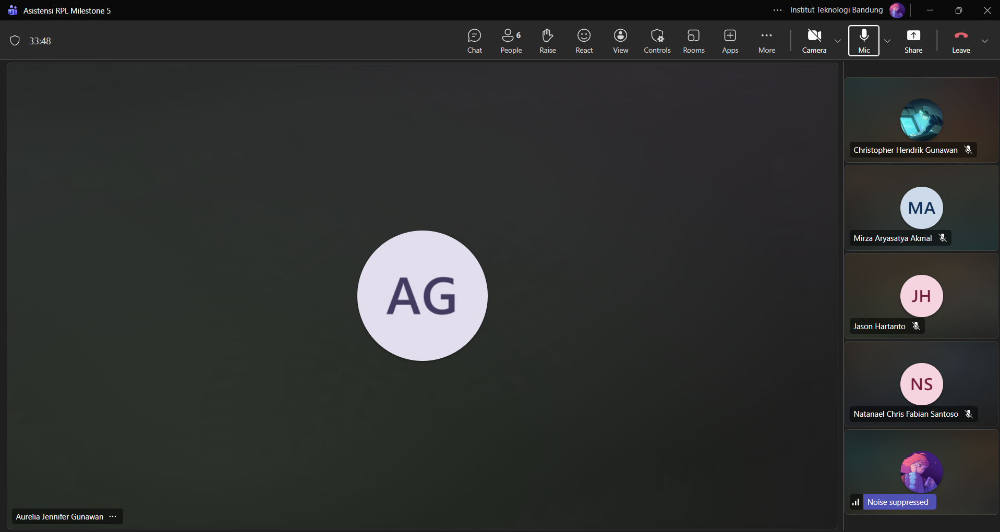

# Form Asistensi

## Tugas Besar IF2150 - Rekayasa Perangkat Lunak

| Informasi | Keterangan |
| --- | --- |
| **Hari** | *Sabtu* |
| **Tanggal** | *16/09/2026* |
| **Kelas** | *02* |
| **Nomor Kelompok** | *10*  |
| **Nama Kelompok** | *RPL at 25*  |
| **Nama Perangkat Lunak** | *SafeShe*  |
| **Dokumen** | *K02_G10_SKPL*  |

### Anggota Kelompok

| NIM | Nama |
| --- | --- |
| *13525083* | *Natanael Chris Fabian Santoso* |
| *13525131* | *Mirza Aryasatya Akmal* |
| *13525149* | *Ferdinand Valentino Darmawan* |
| *13525050* | *Jason Hartanto* |
| *13525065* | *Christopher Hendrik Gunawan* |

### Catatan

| Catatan |
| --- |
| 1. Di bagian 2.1 sebelum diagram bisa tambahkan tabel identifikasi aktivitas dan pemetaan kebutuhan, lalu di bagian kebutuhan pengguna, boleh salin tabel KF dengan tambahan ID yang baru.  |
| 2. Di bagian 1.3, kalau tidak ada istilah yang terlalu teknis bisa saja pake yang template, tapi boleh juga nambahin yang SOS. |
| 3. Di bagian 1.5, di Milestone ini ngereference ke Milestone sebelumnya jadi bisa reference itu buat kaya diagramnya, atau dari buku luar kalau memang dipake dalam pengerjaan Milestone lain. |
| 4. Di bagian 1.6, itu spesifik ke yang dibahas di SKPL (Milestone 5). |
| 5. Di bagian 2.4, dari Milestone 1 mengenai batasan dan bisa ditambah-tambahkan. Tetapi format kalimatnya dibuat mirip seperti template. Kalau ada penambahan batasan, tidak perlu ditambah ke daftar perubahan karena masuk ke pendetailin batasan.|
| 6. Di bagian 2.5, itu masih rencana awal jadi kalau ketika mau implementasi, akan ada dokumen yang bisa buat ganti spek yang dipakai jadi aman kalau nanti berubah. |
| 7. Untuk diagram kelas, ada yang pake kelas API Layanan tapi tidak ada di identifikasi kelas, jadi perlu ditambahin atau disesuaikan diagram kelasnya. 
| 8. Lalu di diagram kelas use case 4, pastikan penamaan kelas yang digunakan sesuai, antara antarmukaTelepon dan teleponAntarmuka, sama itu identifikasi kelas ada dua kelas yang diidentifikasi tetapi tidak digunakan, jadi perlu disesuaikan dengan diagramnya. |

**Notes for this section:**  
*Catatan dapat dituliskan dalam bentuk paragraf atau poin-poin, disesuaikan saja.* 

## Dokumentasi

<!--  -->

  

  <i>Gambar 1. Dokumentasi kegiatan asistensi.</i>

