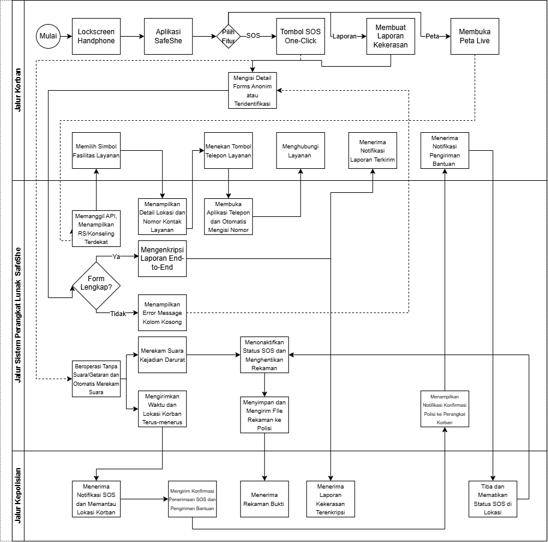
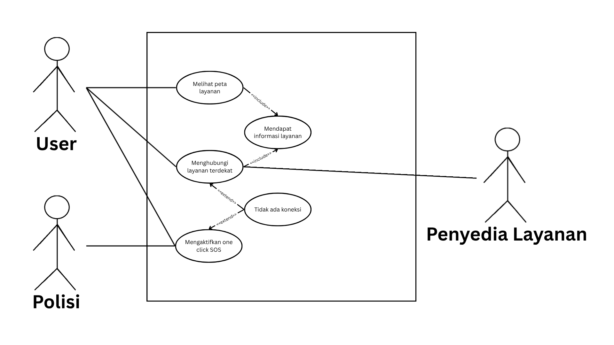
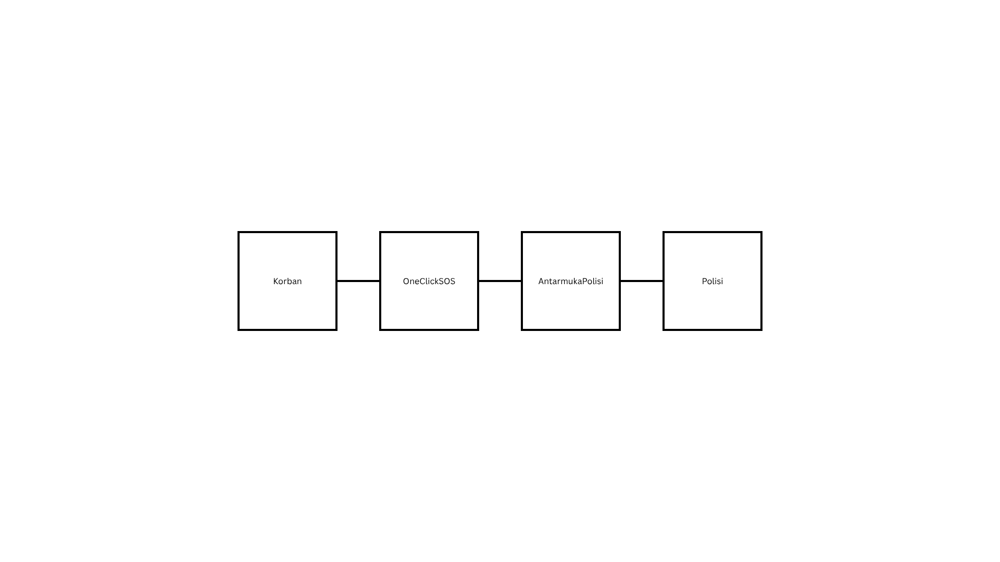
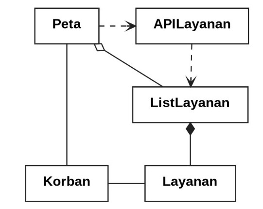
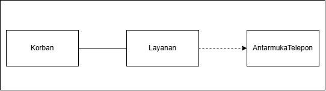
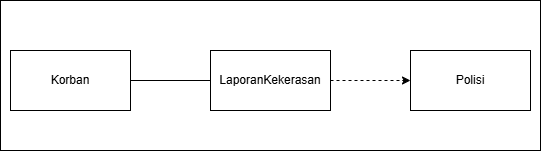
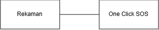
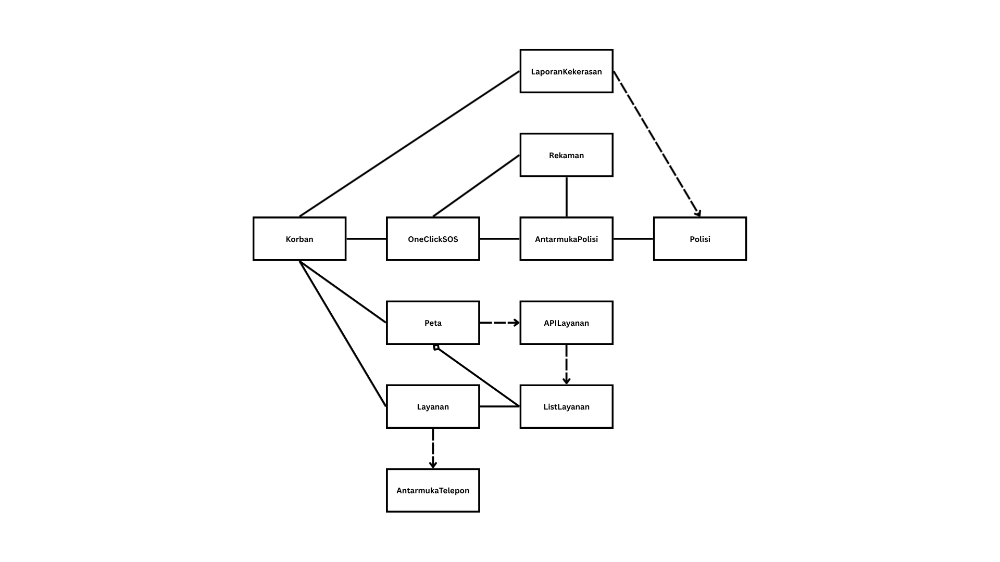

<h1>
IF2150 REKAYASA PERANGKAT LUNAK
 
TUGAS 5
 
SPESIFIKASI KEBUTUHAN PERANGKAT LUNAK (SKPL)
</h1>
 

## *SafeShe*

### Untuk: *Aurelia Jennifer Gunawan*

Dipersiapkan oleh:
| Informasi | Keterangan |
| --- | --- |
| Kelas | *K2* |
| Kelompok | *10*  |

| NIM | Nama |
|---|---|
| *13525083* | *Natanael Chris Fabian Santoso* |
| *13525131* | *Mirza Aryasatya Akmal* |
| *13525149* | *Ferdinand Valentino Darmawan* |
| *13525050* | *Jason Hartanto* |
| *13525065* | *Christopher Hendrik Gunawan* |
---

## Daftar Perubahan

| Revisi | Deskripsi |
| :--- | :--- |
| *A* | *Mengubah diagram swimlane agar sesuai dengan fitur-fitur yang sudah direncanakan di 2.1* |

 

# BAB 1: Pendahuluan

## 1.1 Tujuan Penulisan Dokumen
Dokumen SKPL ini dibuat untuk medeskripsikan dengan detail mengenai berbagai aspek dari perangkat lunak SafeShe agar semuanya memiliki spesifikasi yang jelas sebelum dikembangkan. Dokumen ini diperuntukkan untuk para pengembang perangkat lunak SafeShe dan asisten sebagai salah satu pemangku kepentingan dari pengimplementasian perangkat lunak yang dilakukan oleh para pengembang.

## 1.2 Lingkup Masalah
Aplikasi SafeShe adalah aplikasi yang menyediakan pelaporan kekerasan seksual yang dialami perempuan secara anonim. Aplikasi ini dibuat agar menjadi salah satu solusi untuk mengatasi proses pelaporan dan pendampingan korban dari kekerasan seksual di Indonesia yang masih reaktif dan tidak terintegrasi secara digital. SafeShe akan menyediakan fitur pelaporan anonim yang terenkripsi *end-to-end* dan memiliki peta *real-time* untuk menampilkan fasilitas layanan yang dapat dibutuhkan korban, seperti fasilitas rumah sakit dan konseling. SafeShe juga menyediakan fitur *one-click SOS* untuk memudahkan korban dalam meminta bantuan secara diam-diam dengan konfirmasi balik yang tidak mudah diketahui orang lain ketika bantuan sedang dalam perjalanan menuju lokasi korban. Selain itu, SafeShe akan merekam audio di sekitar korban setelah *one-click SOS* dipencet yang dapat membantu dalam memberikan bukti konkret untuk membantu pembuatan kasus terhadap pelaku kekerasan seksual.

## 1.3 Definisi, Istilah, dan Singkatan
Tabel 1.3. Definisi Istilah dan Singkatan

| Singkatan, Akronim, atau Istilah | Penjelasan |
| :--- | :--- |
| *P/L* | *Singkatan dari Perangkat Lunak, yaitu aplikasi yang memberikan perintah kepada komputer untuk menjalankan tugas tertentu.* |
| *SKPL* | *Singkatan dari Spesifikasi Kebutuhan Perangkat Lunak, yaitu dokumen yang merangkum kriteria-kriteria yang diperlukan untuk membangun aplikasi menjalankan tugasnya.* |
| *KF* | *Singkatan dari Kebutuhan Fungsional.* |
| *KNF* | *Singkatan dari Kebutuhan Non-Fungsional.* |
| *UC* | *Singkatan dari Use Case.* |
| *EARS* | *Easy Approach to Requirements Syntax, yaitu pola penulisan kebutuhan agar konsisten dan mudah diuji.* |

## 1.4 Aturan Penomoran
Tabel 1.4. Aturan Penomoran

| Hal/Bagian | Penomoran | Keterangan |
| :--- | :--- | :--- |
| *Kebutuhan Fungsional* | *KFXX* | |
| *Kebutuhan Non-Fungsional* | *KNFXX* | |
| *Aktor* | *AXX* | |
| *Use Case* | *UCXX* | |
| *Kelas* | *CXX* | |
| *User* | *US-XX* | |
| *Requirement* | *RXX* | |

## 1.5 Referensi
Diagram swimlane SafeShe di BAB 2.1 dibuat dari diagram swimlane SafeShe awal yang dari Milestone 1, diagram keseluruhan use case SafeShe berasal dari Milestone 3, diagram kelas setiap skenario use case dari SafeShe berasal dari Milestone 4. 

## 1.6 Deskripsi Umum Dokumen (Ikhtisar)
BAB 1 membahas pendahuluan dokumen berupa informasi umum dari dokumen, BAB 2 membahas deskripsi umum P/L, BAB 3 membahas kebutuhan fungsional dan non-fungsional, BAB 4 membahas use case serta skenario yang dimilikinya, BAB 5 membahas diagram kelas setiap use case, dan BAB 6 membahas traceability dari setiap diagram kelas dengan use case dan kebutuhan fungsional yang berkaitan.

---

# BAB 2: Deskripsi Perangkat Lunak

## 2.1 Deskripsi Umum Sistem

Fitur utama yang disediakan oleh aplikasi SafeShe adalah pelaporan anonim melalui *one-click SOS*. Fitur ini akan mengirimkan waktu dikirimnya dan lokasi korban ke pihak kepolisian yang anonim dan dapat dilakukan secara diam-diam. Fitur ini disertai dengan opsi untuk menambahkan tombol fitur ini melalui *widget* di handphone korban. Tujuannya dari penerapan fitur ini adalah untuk memudahkan korban membuat laporan yang tidak mudah terdeteksi oleh pelaku kekerasan. Ketika fitur ini dijalankan, handphone akan merekam suara sampai pihak kepolisian sampai di lokasi korban untuk membantu menangani kejadiannya. Tujuannya adalah untuk mendapatkan bukti kekerasan yang lebih konkrit dan dapat digunakan untuk membantu membuat kasus terhadap pelaku kekerasan yang akan ditangani oleh pihak kepolisian.

Selain itu, aplikasi memiliki fitur untuk menampilkan peta *real-time* yang akan menampilkan layanan rumah sakit dan konseling yang terdekat bagi pengguna melalui simbol-simbol yang terdapat di peta. Korban juga dapat mendapatkan informasi kontak dari layanan dan dapat menghubunginya melalui aplikasi yang akan memasukkan nomor telepon ke aplikasi telepon pada handphone. Tujuan dari fitur ini adalah untuk menyediakan bantuan yang mudah dicari dan diakses oleh korban setelah terjadinya kejadian kekerasan.

Lalu pihak kepolisian yang menerima laporan dari aplikasi akan menerima waktu terkirimnya SOS dan lokasi real-time dari handphone korban. Pihak kepolisian dapat melihat sebuah peta dari lokasinya korban selama pihak kepolisian belum sampai di lokasi korban. Setelah pihak kepolisian sudah sampai di lokasi korban, pihak kepolisian dapat mematikan SOS dan aplikasi akan berhenti mengirimkan lokasi real-time korban. Tujuan dari penerapannya adalah untuk memastikan agar pihak kepolisian dapat terus memantau lokasi asli korban selama belum sampai di lokasi korban dan menangani situasi yang terjadi.

Setelah SOS dimatikan, pihak kepolisian juga akan menerima rekaman suara kejadian yang terjadi melalui aplikasi setelah korban mengirimkan SOS. Tujuannya adalah untuk memudahkan pihak kepolisian mendapatkan bukti yang konkrit untuk menangani dan membuat kasus terhadap pelaku kekerasan. 

<i>Gambar 1. Swimlane Diagram SafeShe</i>

## 2.2 Deskripsi Umum Perangkat Lunak
Perangkat lunak SafeShe adalah aplikasi laporan anonim yang diharapkan menjadi sebuah solusi masalah kekerasan terhadap perempuan. SafeShe berinteraksi dengan *One-click SOS* untuk mengirimkan informasi waktu dan lokasi *Korban* ke *Polisi* serta untuk menyalakan perekaman suara. SafeShe akan menerima konfirmasi SOS telah diterima dan bantuan telah dikirim dari *Polisi* dan akan menampilkan notifikasinya kepada *Korban*. Setelah *Polisi* mematikan penerimaan informasi live korban, SafeShe akan mengirimkan *Rekaman Suara* yang telah dikirim ke pihak *Polisi* sebagai sebuah bukti dari kejadian kekerasan seksual yang telah terjadi. SafeShe juga berinteraksi dengan *Sistem Pelaporan* untuk menyediakan pelaporan kekerasan seksual yang dialami *Korban* yang diamankan dengan *Enkripsi End-to-end* setiap kali laporan dibuat yang diteruskan ke *Polisi*. SafeShe dapat berinteraksi dengan *Peta Real-time* untuk menampilkan lokasi live dari *Korban* mengenai berbagai *Fasilitas Lyananan* yang tersedia di sekitarnya. Lalu, SafeShe dapat berinteraksi dengan sebuah *Fasilitas Layanan* untuk menampilkan informasi lokasi dan kontak layanan tersebut, serta agar *Korban* dapat menghubunginya melalui *Aplikasi Telepon* yang terdapat pada handphone *Korban*.

## 2.3 Pengguna dan Kebutuhan Pengguna Perangkat Lunak
| Aktor | Deskripsi |
| :--- | :--- |
| *Korban* | *Pengguna ini bertindak sebagai pihak yang memerlukan bantuan karena telah mengalami kekerasan seksual. Karakteristik dari pengguna ini adalah mengutamakan keamanan, kecepatan, dan konfirmasi respons untuk bantuan dari pihak kepolisian.* |
| *Polisi* | *Pengguna ini bertindak sebagai pihak yang memantau notifikasi SOS yang dikirimkan oleh korban. Karakteristik dari pengguna ini adalah menginginkan lokasi korban untuk memberi bantuan, mendapatkan bukti untuk membantu pembuatan kasus terhadap pelaku kekerasan seksual, serta kemampuan untuk mengirimkan notifikasi kembali kepada korban bahwa SOS telah diterima dan bantuan sedang dalam perjalanan.* |

## 2.4 Batasan Perangkat Lunak
Batasan yang harus dituliskan, di antaranya:
1. *P/L harus mengikuti regulasi hukum yang berlaku untuk penanganan kasus kekerasan seksual, seperti penanganan pengambilan serta penyimpanan bukti.*
2. *P/L tidak dapat digunakan pada lock screen handphone, pengguna harus membuka handphonenya terlebih dahulu sebelum menekan tombol SOS*
3. *P/L bergantung pada kemauan pihak polisi untuk merespons notifikasi SOS dengan baik, termasuk ketika SOS tidak digunakan sebagaimana mestinya.*

## 2.5 Lingkungan Operasi Perangkat Lunak
Spesifikasi *operating system* atau lingkungan yang dibutuhkan P/L untuk beroperasi. Bagian ini digunakan untuk memastikan pengguna memiliki spesifikasi yang cukup untuk menjalankan P/L. Misalnya mencakup komponen server, client, OS, DBMS, tetapi tidak menutupi kemungkinan komponen lain.

| Komponen | Spesifikasi |
| :--- | :--- |
| *Server* | *Lingkungan Linux (Docker) yang dihosting pada layanan cloud (AWS/Google Cloud/Azure). Bahasa Python (FastAPI) dengan API Gateway* |
| *Client* | *React Native, penyimpanan lokal dengan SQLite* |
| *DBMS* | *PostgreSQL* |
| *OS* | *Cross-platform Android dan iOS* |

---

# BAB 3: Deskripsi Kebutuhan Perangkat Lunak

## 3.1 Kebutuhan Fungsional (KF)
| ID KF | ID Kebutuhan | Penjelasan |
| :--- | :--- | :--- |
| *KF01* | *R01* | *Diberikan perangkat user memiliki fitur widget, ketika Peragkat Lunak diaktifkan, maka sistem menampilkan sebuah tombol one click SOS dalam bentuk widget aplikasi yang selalu ditampilkan di layar perangkat ketika perangkat aktif dan terbuka (tidak di-lock).* |
| *KF02* | *R02* | *Ketika user melakukan pelaporan, sistem akan bekerja tanpa membuat perangkat user bersuara atau bergetar agar tidak diketahui pelaku kekerasan.* |
| *KF03* | *R04* | *Ketika laporan awal dibuat, sistem akan mengenkripsi laporan tersebut secara end-to-end dan menyimpannya menggunakan blockchain-based timestamp.* |
| *KF04* | *R05* | *Ketika perangkat user dalam kondisi mati atau terkunci, sistem akan menyembunyikan tombol one click SOS dalam bentuk widget aplikasi agar tidak dapat ditekan secara tidak sengaja.* |
| *KF05* | *R06* | *Ketika user menekan tombol untuk menampilkan peta live, sistem akan menampilkan di seluruh layar sebuah peta live yang menampilkan fasilitas layanan terdekat, seperti rumah sakit, tempat konseling, dan area beresiko tinggi.* |
| *KF06* | *R07* | *Diberikan terdapat API yang dapat menampilkan data lokasi rumah sakit dan tempat konseling, ketika sistem akan menampilkan peta live kepada user, sistem akan memanggil API tersebut untuk memperoleh data lokasi rumah sakit dan tempat konseling yang akurat.* |
| *KF07* | *R09* | *Diberikan perangkat user memiliki sebuah mikrofon, ketika tombol one click SOS ditekan, sistem akan langsung mengaktifkan mikrofon perangkat user untuk merekam suara dalam keadaan darurat.* |
| *KF08* | *R11* | *Ketika pihak kepolisian mengirimkan notifikasi kepada sistem sebagai wujud konfirmasi kepada korban, sistem akan menerima notifikasi tersebut dan menampilkan notifikasi tersebut di layar perangkat korban.* |
| *KF09* | *R12* | *Saat tombol one-click SOS aktif, sistem secara terus menerus akan mengirimkan data lokasi kepada pihak kepolisian hingga status SOS dinonakifkan.* |
| *KF10* | *R13* | *Sistem otomatis menonaktifkan status SOS korban dan menghentikan pengiriman data lokasi setelah pihak kepolisian sampai dan memberikan input kepada sistem.* |
| *KF11* | *R14* | *Sistem mengirimkan file rekaman suara darurat dari perangkat korban kepada pihak kepolisian.* |
| *KF12* | *R08* | *Ketika pengguna memilih menghubungi layanan tertentu, sistem akan otomatis membuka aplikasi telepon bawaan pada perangkat pengguna dan mengisi nomor kontak layanan.* |

## 3.2 Kebutuhan Non-Fungsional (KNF)

| ID KNF | ID Kebutuhan | Parameter | Deskripsi Kebutuhan |
| :--- | :--- | :--- | :--- |
| *KNF01* | *R01* | *Availability* | *User harus dapat menggunakan fitur one click SOS kapan saja.* |
| *KNF02* | *R02* | *Safety* | *Saat aktivitas pelaporan dilakukan, aktivitas tersebut tidak diketahui oleh pelaku kekerasan.* |
| *KNF03* | *R03* | *Reliability* | *Sistem harus melibatkan pihak kepolisian.* |
| *KNF04* | *R04* | *Security* | *Sistem harus mengamankan laporan.* |
| *KNF05* | *R04* | *Security* | *Sistem harus memastikan keabsahan bukti dalam ranah hukum.* |
| *KNF06* | *R08* | *Information* | *Saat user ingin melihat informasi kontak fasilitas layanan terkait, sistem akan memperlihatkan informasi yang terbaru dan relevan.*|
| *KNF07* | *R08* | *Availability* | *Diberikan fasilitas layanan terkait tersedia, saat user ingin menghubungi kontak fasilitas layanan tersebut lewat aplikasi, sistem akan mengalihkan user ke aplikasi telepon.*|
| *KNF08* | *R10* | *Security* | *Sistem harus mengambil dan menyimpan bukti sesuai dengan batas regulasi hukum yang berlaku.* |
| *KNF09* | *R11* | *Responsivity* | *Polisi harus dapat mengirimkan notifikasi kembali kepada korban sebagai konfirmasi bahwa bantuan sedang dalam perjalanan.* |

---

# BAB 4: Pemodelan Use Case

## 4.1 Identifikasi Aktor
Daftarkan seluruh aktor yang terlibat dalam use case yang akan dimodelkan. Aktor berupa pengguna manusia yang berinteraksi dengan solusi. Perlu diperhatikan bahwa Admin/Developer/ Pihak Eksternal lain yang bisa diotomisasi, tidak perlu dijadikan aktor.

| Aktor | Deskripsi |
| :--- | :--- |
| *Korban* | *Pengguna ini bertindak sebagai pihak yang memerlukan bantuan karena telah mengalami kekerasan seksual. Karakteristik dari pengguna ini adalah mengutamakan keamanan, kecepatan, dan konfirmasi respons untuk bantuan dari pihak kepolisian.* |
| *Polisi* | *Pengguna ini bertindak sebagai pihak yang memantau notifikasi SOS yang dikirimkan oleh korban. Karakteristik dari pengguna ini adalah menginginkan lokasi korban untuk memberi bantuan, mendapatkan bukti untuk membantu pembuatan kasus terhadap pelaku kekerasan seksual, serta kemampuan untuk mengirimkan notifikasi kembali kepada korban bahwa SOS telah diterima dan bantuan sedang dalam perjalanan.* |

## 4.2 Identifikasi Use Case
Identifikasi seluruh use case yang mencakup Kebutuhan Fungsional pada BAB 2. Satu use case boleh mencakup lebih dari satu KF, dan sebaliknya satu KF boleh muncul di lebih dari satu use case bila memang relevan.

| ID UC | Nama Use Case | Deskripsi Singkat | Aktor Terlibat | ID KF Terkait |
| :--- | :--- | :--- | :--- | :--- |
| *UC01* | *Mengaktifkan one click SOS* | *Korban menekan tombol SOS untuk mengirimkan laporan dan lokasi dengan cepat, sistem otomatis mulai merekam suara, polisi akan mengupdate status laoran setelah menapatkan laporannya* | *Korban, Polisi* | *KF01, KF02, KF03, KF04, KF07, KF08, KF09, KF10* |
| *UC02* | *Melihat Peta Layanan Terdekat* | *Korban membuka peta yang menampilkan fasilitas layanan terdekat* | *Korban* | *KF05, KF06* |
| *UC03* | *Memilih Layanan Terdekat* | *Korban memilih layanan terdekat dengan menekan simbol fasilitas* | *Korban* | *KF05, KF06* |
| *UC04* | *Menghubungi Layanan Terdekat* | *Korban melihat informasi kontak fasilitas layanan pada peta dan dapat menghubungi secara langsung melalui aplikasi* | *Korban* | *KF12* |
| *UC05* | *Membuat Laporan Kekerasan* | *Korban melakukan pelaporan tindakan kekerasan melalui form dengan opsi anonim/teridentifikasi yang kemudian diproses sistem* | *Korban* | *KF02, KF03* |
| *UC06* | *Merekam Suara Otomatis Ketika One Click SOS Diaktifkan* | *Sistem menyalakan mikrofon gawai korban secara otomatis ketika One Click SOS Diaktifkan* | *Korban* | *KF07,KF11* |
| *UC07* | *Mengirim Notifikasi Konfirmasi Polisi Ke Korban* | *Sistem mengirimkan notifikasi kepada korban ketika polisi menerima informasi keadaan darurat dan mengonfirmasi hal tersebut* | *Korban, Polisi* | *KF08* |

## 4.3 Use Case Diagram
 

<i>Gambar 1. Contoh Use Case Diagram</i>

 

Hal-hal yang perlu diperhatikan dalam pembuatan use case diagram:
- Pastikan notasi UML use case (aktor, oval use case, garis asosiasi, *include/extend*) digambar dengan benar.
- Seluruh aktor dan use case yang telah didefinisikan harus muncul di diagram, tidak ada yang terlewat maupun berlebih.
- Hindari garis yang saling bersilangan tanpa alasan jelas, susun diagram agar mudah dibaca.
- Hindari istilah solusi teknis (misalnya nama tabel database, nama endpoint API) muncul di dalam diagram use case karena use case menjelaskan *interaksi fungsional*, bukan detail implementasi.

## 4.4 Skenario Use Case
Buat skenario untuk **setiap** use case yang telah diidentifikasi pada 3.2. Setiap skenario dapat terdiri dari dua jenis alur:
- **Skenario Normal**: alur utama (*happy path*) di mana interaksi aktor-sistem berjalan lancar tanpa kendala hingga tujuan use case tercapai.
- **Skenario Alternatif**: alur percabangan dari skenario normal, misalnya kondisi gagal, input tidak valid, atau pilihan lain yang tersedia bagi aktor. Boleh ada lebih dari satu skenario alternatif per use case jika ada beberapa titik percabangan berbeda.

Format tabel skenario: kolom **Aksi Aktor** berisi apa yang dilakukan/diinput aktor, kolom **Reaksi Perangkat Lunak** berisi respons sistem terhadap aksi tersebut secara **berurutan** (nomor langkah harus berpasangan/selaras antar dua kolom).

### 4.4.1 Skenario UC01

**Nama Use Case:** *Melakukan Pembayaran Digital*

**Skenario Normal**

| No | Aksi Aktor | Reaksi Perangkat Lunak |
| :--- | :--- | :--- |
| 1 | *Pelanggan memilih menu checkout* | *Sistem menampilkan ringkasan pesanan dan pilihan metode pembayaran* |
| 2 | *Pelanggan memilih metode pembayaran (misal: e-wallet)* | *Sistem mengarahkan pelanggan ke halaman konfirmasi e-wallet* |

 

**Skenario Alternatif 1: Otorisasi Pembayaran Gagal**

| No | Aksi Aktor | Reaksi Perangkat Lunak |
| :--- | :--- | :--- |
| 1 | *Korban merasa terancam dan menyalakan device untuk menekan One Click SOS aplikasi SafeShe* | *Sistem menampilkan tombol One Click SOS dalam bentuk widget aplikasi ketika gawai korban dinyalakan dan dibuka (tidak di-lock)* |
| 2 | *Korban menekan tombol One Click SOS via widget aplikasi* | *Tanpa bersuara, sistem menampilkan animasi tombol ditekan, lalu mencoba mengirimkan informasi terkait keadaan darurat korban sekarang ke pihak berwajib, tetapi informasi gagal dikirimkan* |
| 3 | *Korban menunggu konfirmasi kegagalan sistem* | *Sistem mengirimkan notifikasi gagal mengirimkan informasi ke pihak berwajib. Sistem kembali ke langkah 2 skenario normal* |

### 4.4.2 Skenario UC02

**Nama Use Case:** *Melihat Peta Layanan Terdekat*

**Skenario Normal**

| No | Aksi Aktor | Reaksi Perangkat Lunak |
| :--- | :--- | :--- |
| 1 | *Korban menekan tombol peta* | *Sistem menampilkan peta live di sekitar lokasi korban* |
| 2 | *Korban menunggu beberapa detik* | *Sistem memanggil API yang berisi informasi layanan yang tersedia di sekitar lokasi korban dan menampilkan lokasi akurat layanan yang tersedia melalui simbol-simbol di peta* |

 

**Skenario Alternatif 1: API Tidak Dapat Dipanggil**

| No | Aksi Aktor | Reaksi Perangkat Lunak |
| :--- | :--- | :--- |
| 1 | *Korban menekan tombol peta* | *Sistem menampilkan peta live di sekitar lokasi korban* |
| 2 | *Korban menunggu beberapa detik* | *Sistem  memanggil API yang berisi informasi layanan yang tersedia di sekitar lokasi korban, tetapi API gagal untuk dipanggil* |
| 3 | *Korban melihat peta* | *Sistem tidak menampilkan simbol-simbol layanan yang tersedia karena tidak dapat mendapatkan informasi lokasi akurat dan nomor kontak layanan* |

### 4.4.3 Skenario UC03

**Nama Use Case:** *Memilih Layanan Terdekat*

**Skenario Normal**
| :--- | :--- | :--- |
| 1 | *Korban melihat layanan yang tersedia* | *Sistem memanggil API yang berisi informasi layanan yang tersedia di sekitar lokasi korban dan menampilkan lokasi akurat layanan yang tersedia melalui simbol-simbol di peta* |
| 2 | *Korban  memilih sebuah layanan dengan menekan simbol* | *Sistem menampilkan informasi lokasi dan nomor kontak layanan yang ditekan* |

**Skenario Alternatif 1: Informasi yang Dipanggil API Tidak Lengkap**

| No | Aksi Aktor | Reaksi Perangkat Lunak |
| :--- | :--- | :--- |
| 1 | *Korban melihat layanan yang tersedia* | *Sistem memanggil API yang berisi informasi layanan yang tersedia di sekitar lokasi korban dan menampilkan lokasi layanan yang tersedia melalui simbol-simbol di peta* |
| 3 | *Korban memilih sebuah layanan dengan menekan simbol* | *Sistem menampilkan informasi layanan tetapi tidak lengkap, antara hanya informasi lokasi atau nomor kontak layanan yang tersedia* |

### 4.4.4 Skenario UC04

**Nama Use Case:** *Memilih Layanan Terdekat*

**Skenario Normal**
| :--- | :--- | :--- |
| 1 | *Korban melihat layanan yang tersedia* | *Sistem memanggil API yang berisi informasi layanan yang tersedia di sekitar lokasi korban dan menampilkan lokasi akurat layanan yang tersedia melalui simbol-simbol di peta* |
| 2 | *Korban  memilih sebuah layanan dengan menekan simbol* | *Sistem menampilkan informasi lokasi dan nomor kontak layanan yang ditekan* |

**Skenario Alternatif 1: Informasi yang Dipanggil API Tidak Lengkap**

| No | Aksi Aktor | Reaksi Perangkat Lunak |
| :--- | :--- | :--- |
| 1 | *Korban melihat layanan yang tersedia* | *Sistem memanggil API yang berisi informasi layanan yang tersedia di sekitar lokasi korban dan menampilkan lokasi layanan yang tersedia melalui simbol-simbol di peta* |
| 3 | *Korban memilih sebuah layanan dengan menekan simbol* | *Sistem menampilkan informasi layanan tetapi tidak lengkap, antara hanya informasi lokasi atau nomor kontak layanan yang tersedia* |

### 4.4.5 Skenario UC05

**Nama Use Case:** *Menghubungi Layanan Terdekat*

**Skenario Normal**

| No | Aksi Aktor | Reaksi Perangkat Lunak |
| :--- | :--- | :--- |
| 1 | *Korban menekan tombol layanan pada peta* | *Sistem menampilkan informasi kontak layanan beserta tombol untuk menelepon* |
| 2 | *Korban menekan tombol telepon* | *Sistem membuka aplikasi telepon pada perangkat dan mengisi nomor telepon kontak secara otomatis* |

 

**Skenario Alternatif 1: Informasi Kontak Tidak Tersedia**

| No | Aksi Aktor | Reaksi Perangkat Lunak |
| :--- | :--- | :--- |
| 1 | *Korban menekan tombol layanan yang tidak memiliki nomor kontak* | *Sistem menampilkan informasi layanan tanpa tombol telepon dan memberi keterangan "Nomor kontak pada layanan ini belum tersedia"* |

### 4.4.6 Skenario UC06

**Nama Use Case:** *Merekam Suara Otomatis Ketika One Click SOS Diaktifkan*

**Skenario Normal**

| No | Aksi Aktor | Reaksi Perangkat Lunak |
| :--- | :--- | :--- |
| 1 | *Korban menekan tombol One Click SOS* | *Sistem mengikuti prosedur sesuai UC01 skenario normal* |
| 2 | *Korban menunggu konfirmasi mikrofon sudah diaktifkan* | *Sistem menyalakan mikrofon gawai dan mengirimkan notifikasi bahwa mikrofon berhasil dinyalakan dan sedang merekam* |

**Skenario Alternatif 1: Mikrofon Gawai Korban Tidak Dapat Diaktifkan**

| No | Aksi Aktor | Reaksi Perangkat Lunak |
| :--- | :--- | :--- |
| 1 | *Korban menekan tombol One Click SOS* | *Sistem mengikuti prosedur sesuai UC01 skenario normal* |
| 2 | *Korban menunggu konfirmasi mikrofon sudah diaktifkan* | *Sistem mencoba menyalakan mikrofon gawai tetapi gagal dan menampilkan notifikasi bahwa mikrofon gagal diaktifkan* |

### 4.4.7 Skenario UC07

**Nama Use Case:** *Mengirim Notifikasi Konfirmasi Polisi Ke Korban*

**Skenario Normal**

| No | Aksi Aktor | Reaksi Perangkat Lunak |
| :--- | :--- | :--- |
| 1 | *Polisi menunggu notifikasi informasi terkait kejadian darurat* | *Sistem mengirimkan notifikasi kepada polisi tentang kejadian darurat* |
| 2 | *Polisi menerima informasi, lalu mengirimkan notifikasi konfirmasi kepada korban* | *Sistem meneruskan dan menampilkan notifikasi konfirmasi tersebut di gawai korban* |

**Skenario Alternatif 1: Kendala Jaringan dan Gagal Terhubung Ke Server**

| No | Aksi Aktor | Reaksi Perangkat Lunak |
| :--- | :--- | :--- |
| 1 | *Polisi menunggu notifikasi informasi terkait kejadian darurat* | *Sistem mengirimkan notifikasi kepada polisi tentang kejadian darurat* |
| 2 | *Polisi menerima infomasi, lalu mengirimkan notifikasi konfirmasi kepada korban* | *Karena kendala jaringan, sistem mengirimkan notifikasi bahwa notifikasi konfirmasi gagal dikirimkan. Lalu, melanjutkan langkah ke langkah 2 skenario normal* |

---

# BAB 5: Pemodelan Kelas

## 5.1 Identifikasi Kelas
Identifikasi seluruh kelas yang diperlukan berdasarkan use case dan skenarionya. Satu kelas boleh terkait dengan lebih dari satu use case.

| ID Kelas | Nama Kelas | Deskripsi Kelas | ID Use Case |
| :--- | :--- | :--- | :--- |
| *C01* | *OneClickSOS* | *Mengendalikan proses penyampaian dan penerimaan signal untuk sisi pengguna* | *UC01, UC06, UC07* |
| *C02* | *AntarmukaPolisi* | *Mengendalikan penerimaan dan penyampaian signal untuk sisi polisi* | *UC01, UC06, UC07* |
| *C03* | *Korban* | *Menyimpan data korban yang melakukan panggilan SOS.* | *UC01, UC04, UC05, UC07* |
| *C04* | *Peta* | *Menyediakan data peta dari lokasi di sekitar korban.* | *UC04* |
| *C05* | *ListLayanan* | *Menyimpan kumpulan data layanan yang tersedia di sekitar lokasi korban.* | *UC04* |
| *C06* | *Layanan* | *Menyimpan data dari sebuah layanan.* | *UC04* |
| *C07* | *AntarmukaTelepon* | *Mengendalikan pemasukan nomor telepon ke aplikasi telepon pada handphone korban.* | *UC04* |
| *C08* | *Polisi* | *Menyimpan data polisi yang memberikan respons ke panggilan SOS* | *UC01, UC05, UC07* |
| *C09* | *Rekaman* | *Merekam dan menyimpan rekaman suara pada handphone korban* | *UC06* |
| *C10* | *LaporanKekerasan* | *Menyimpan data laporan kekerasan yang dibuat korban.* | *UC05* |
  *C11* | *APILayanan* | *Menghubungkan sistem ke API eksternal untuk mengambil data layanan terdekat dari lokasi korban.* |*UC02, UC03* |

## 5.2 Diagram Kelas per Use Case
Buat diagram kelas untuk setiap use case pada 3.2.

### 5.2.1 Use Case UC01

**Nama Use Case:** *Mengaktifkan one click SOS*

#### Identifikasi Kelas

| ID Kelas | Nama Kelas | Deskripsi Kelas |
| :--- | :--- | :--- |
| *C01* | *OneClickSOS* | *Mengendalikan proses penyampaian dan penerimaan signal untuk sisi pengguna* |
| *C02* | *AntarmukaPolisi* | *Mengendalikan penerimaan dan penyampaian signal untuk sisi polisi* |
| *C03* | *Korban* | *Menyimpan data korban yang melakukan panggilan SOS.* |
| *C08* | *Polisi* | *Menyimpan data polisi yang memberikan respons ke panggilan SOS* |

#### Diagram Kelas

<i>Gambar 2. Diagram Kelas Use Case UC01</i>

 

Pada diagram kelas, cukup tampilkan nama kelas saja. Atribut dan metode/operasi milik setiap kelas dapat dituliskan pada tabel di bawah ini. Pastikan hubungan antarkelas menggunakan jenis relasi yang sesuai (asosiasi, agregasi, komposisi, generalisasi, atau dependensi).

| ID Kelas | Nama Kelas | Atribut | Metode/Operasi |
| :--- | :--- | :--- | :--- |
| *C01* | *OneClickSOS* | *-* | *menerimaReply(reply), signalMikrofon(), dapatLokasi(), kirimSinyal(lokasi)* |
| *C02* | *AntarmukaPolisi* | *-* | *menerimaSinyal(signal), kirimReply()* |
| *C03* | *Korban* | *lokasiKorban, namaKorban* | *lokasiKorbanSekarang(), panggilSOS(oneclicksos)* |
| *C08* | *Polisi* | *lokasiPolisi, ketersediaan* | *pantauAntarmuka(antarmukaPolisi), terimaLaporan(laporanKekerasan), kirimPasukan()* |

### 5.2.2 Use Case UC02

**Nama Use Case:** *Melihat Peta Layanan Terdekat*

#### Identifikasi Kelas

| ID Kelas | Nama Kelas | Deskripsi Kelas | ID Use Case |
| :--- | :--- | :--- | :--- |
| *C03* | *Korban* | *Menyimpan data korban yang melakukan panggilan SOS.* | *UC01, UC04, UC07* |
| *C04* | *Peta* | *Menyediakan data peta dari lokasi di sekitar korban.* | *UC04* |
| *C05* | *ListLayanan* | *Menyimpan kumpulan data layanan yang tersedia di sekitar lokasi korban.* | *UC04* |
| *C06* | *Layanan* | *Menyimpan data dari sebuah layanan.* | *UC04* |
  *C11* | *APILayanan* | *Menghubungkan sistem ke API eksternal untuk mengambil data layanan terdekat dari lokasi korban.* |*UC02, UC03* |

#### Diagram Kelas

<i>Gambar 3. Diagram Kelas Use Case UC02</i>

 

Pada diagram kelas, cukup tampilkan nama kelas saja. Atribut dan metode/operasi milik setiap kelas dapat dituliskan pada tabel di bawah ini. Pastikan hubungan antarkelas menggunakan jenis relasi yang sesuai (asosiasi, agregasi, komposisi, generalisasi, atau dependensi).

| ID Kelas | Nama Kelas | Atribut | Metode/Operasi |
| :--- | :--- | :--- | :--- |
| *C03* | *Korban* | *lokasiKorban, namaKorban* | *lokasiKorbanSekarang()* |
| *C04* | *Peta* | *lokasiPeta* | *lokasiPetaSekarang(), lokasiSekitar(korban), tampilkanLayanan(listLayanan)* |
| *C05* | *ListLayanan* | *kumpulanLayanan* | *ambilLayananTersedia(peta)* |
| *C06* | *Layanan* | *namaLayanan, lokasiLayanan, kontakLayanan* | *ambilDataLayanan(ListLayanan), ambilLokasi(), ambilNama()* |
| *C11* | *APILayanan* | *urlAPI* | *ambilDataLayanan(peta)* |

### 5.2.3 Use Case UC03

**Nama Use Case:** *Memilih Layanan Terdekat*

#### Identifikasi Kelas

| ID Kelas | Nama Kelas | Deskripsi Kelas |
| :--- | :--- | :--- |
| *C03* | *Korban* | *Menyimpan data korban yang melakukan panggilan SOS.* | *UC01, UC04, UC07* |
| *C04* | *Peta* | *Menyediakan data peta dari lokasi di sekitar korban.* | *UC04* |
| *C05* | *ListLayanan* | *Menyimpan kumpulan data layanan yang tersedia di sekitar lokasi korban.* | *UC04* |
| *C06* | *Layanan* | *Menyimpan data dari sebuah layanan.* | *UC04* |
  *C11* | *APILayanan* | *Menghubungkan sistem ke API eksternal untuk mengambil data layanan terdekat dari lokasi korban.* |*UC02, UC03* |
  
#### Diagram Kelas

<i>Gambar 4. Diagram Kelas Use Case UC03</i>

 

Pada diagram kelas, cukup tampilkan nama kelas saja. Atribut dan metode/operasi milik setiap kelas dapat dituliskan pada tabel di bawah ini. Pastikan hubungan antarkelas menggunakan jenis relasi yang sesuai (asosiasi, agregasi, komposisi, generalisasi, atau dependensi).

| ID Kelas | Nama Kelas | Atribut | Metode/Operasi |
| :--- | :--- | :--- | :--- |
| ID Kelas | Nama Kelas | Atribut | Metode/Operasi |
| :--- | :--- | :--- | :--- |
| *C03* | *Korban* | *lokasiKorban, namaKorban* | *pilihLayanan(layanan)* |
| *C05* | *ListLayanan* | *kumpulanLayanan* | *ambilLayananTersedia(peta)* |
| *C06* | *Layanan* | *namaLayanan, lokasiLayanan, kontakLayanan* | *ambilDataLayanan(ListLayanan), ambilKontak(), ambilLokasi(), ambilNama()* |
| *C11* | *APILayanan* | *urlAPI* | *ambilDataLayanan(peta)* |

### 5.2.4 Use Case UC04

**Nama Use Case:** *Menghubungi Layanan Terdekat*

#### Identifikasi Kelas

| ID Kelas | Nama Kelas | Deskripsi Kelas |
| :--- | :--- | :--- |
| *C03* | *Korban* | *Menyimpan data korban yang melakukan panggilan SOS.* |
| *C06* | *Layanan* | *Menyimpan data dari sebuah layanan.* |
| *C07* | *AntarmukaTelepon* | *Mengendalikan pemasukan nomor telepon ke aplikasi telepon pada handphone korban.* |

#### Diagram Kelas

<i>Gambar 5. Diagram Kelas Use Case UC04</i>

 

Pada diagram kelas, cukup tampilkan nama kelas saja. Atribut dan metode/operasi milik setiap kelas dapat dituliskan pada tabel di bawah ini. Pastikan hubungan antarkelas menggunakan jenis relasi yang sesuai (asosiasi, agregasi, komposisi, generalisasi, atau dependensi).

| ID Kelas | Nama Kelas | Atribut | Metode/Operasi |
| :--- | :--- | :--- | :--- |
| *C03* | *Korban* | *lokasiKorban, namaKorban* | *lokasiKorbanSekarang(), panggilSOS(oneclicksos), pilihLayanan(layanan), teleponLayanan(layanan)* |
| *C06* | *Layanan* | *namalayanan, lokasiLayanan, kontakLayanan* | *ambilDataLayanan(ListLayanan), ambilKontak(), ambilLokasi(), ambilNama()* |
| *C07* | *AntarmukaTelepon* | *-* | *masukkanNomorLayanan(layanan)* |

### 5.2.5 Use Case UC05

**Nama Use Case:** *Membuat Laporan Kekerasan*

#### Identifikasi Kelas

| ID Kelas | Nama Kelas | Deskripsi Kelas |
| :--- | :--- | :--- |
| *C03* | *Korban* | *Menyimpan data korban yang melakukan panggilan SOS.* |
| *C08* | *Polisi* | *Menyimpan data polisi yang memberikan respons ke panggilan SOS* | 
| *C10* | *LaporanKekerasan* | *Menyimpan data laporan kekerasan yang dibuat korban.* |

#### Diagram Kelas

<i>Gambar 6. Diagram Kelas Use Case UC05</i>

 

Pada diagram kelas, cukup tampilkan nama kelas saja. Atribut dan metode/operasi milik setiap kelas dapat dituliskan pada tabel di bawah ini. Pastikan hubungan antarkelas menggunakan jenis relasi yang sesuai (asosiasi, agregasi, komposisi, generalisasi, atau dependensi).

| ID Kelas | Nama Kelas | Atribut | Metode/Operasi |
| :--- | :--- | :--- | :--- |
| *C03* | *Korban* | *lokasiKorban, namaKorban* | *lokasiKorbanSekarang(), panggilSOS(oneclicksos), pilihLayanan(layanan), teleponLayanan(layanan)* |
| *C08* | *Polisi* | *lokasiPolisi, ketersediaan* | *pantauAntarmuka(antarmukaPolisi), terimaLaporan(laporanKekerasan), kirimPasukan()* |
| *C10* | *LaporanKekerasan* | *deskripsiKekerasan, tanggalKekerasan, lokasiKekerasan, modePelapor* | *masukkanDeskripsi(), masukkanTanggal(), masukkanLokasi(), masukkanMode()* |

### 5.2.6 Use Case UC06

**Nama Use Case:** *Merekam Suara Otomatis Ketika One Click SOS Diaktifkan*

#### Identifikasi Kelas

| ID Kelas | Nama Kelas | Deskripsi Kelas |
| :--- | :--- | :--- |
| *C01* | *OneClickSOS* | *Mengendalikan proses penyampaian dan penerimaan signal untuk sisi pengguna* |
| *C03* | *Korban* | *Menyimpan data korban yang melakukan panggilan SOS.* |

#### Diagram Kelas

<i>Gambar 7. Diagram Kelas Use Case UC06</i>

 

| ID Kelas | Nama Kelas | Atribut | Metode/Operasi |
| :--- | :--- | :--- | :--- |
| *C01* | *OneClickSOS* | *-* | *menerimaReply(reply), signalMikrofon(), dapatLokasi(), kirimSinyal(lokasi)* |
| *C09* | *Rekaman* | *rekamanSuara* | *mulaiRekamanSuara(), simpanRekamanSuara()* |

### 5.2.7 Use Case UC07

**Nama Use Case:** *Mengirim Notifikasi Konfirmasi Polisi Ke Korban*

#### Identifikasi Kelas

| ID Kelas | Nama Kelas | Deskripsi Kelas |
| :--- | :--- | :--- |
| *C01* | *OneClickSOS* | *Mengendalikan proses penyampaian dan penerimaan signal untuk sisi pengguna* |
| *C02* | *AntarmukaPolisi* | *Mengendalikan penerimaan dan penyampaian signal untuk sisi polisi* |
| *C03* | *Korban* | *Menyimpan data korban yang melakukan panggilan SOS.* |
| *C08* | *Polisi* | *Menyimpan data polisi yang memberikan respons ke panggilan SOS* |

#### Diagram Kelas

<i>Gambar 8. Diagram Kelas Use Case UC07</i>

 

Pada diagram kelas, cukup tampilkan nama kelas saja. Atribut dan metode/operasi milik setiap kelas dapat dituliskan pada tabel di bawah ini. Pastikan hubungan antarkelas menggunakan jenis relasi yang sesuai (asosiasi, agregasi, komposisi, generalisasi, atau dependensi).

| ID Kelas | Nama Kelas | Atribut | Metode/Operasi |
| :--- | :--- | :--- | :--- |
| *C01* | *OneClickSOS* | *-* | *menerimaReply(reply), signalMikrofon(), dapatLokasi(), kirimSinyal(lokasi)* |
| *C02* | *AntarmukaPolisi* | *-* | *menerimaSinyal(signal), kirimReply()* |
| *C03* | *Korban* | *lokasiKorban, namaKorban* | *lokasiKorbanSekarang(), panggilSOS(oneclicksos), pilihLayanan(layanan), teleponLayanan(layanan)* |
| *C08* | *Polisi* | *lokasiPolisi, ketersediaan* | *pantauAntarmuka(antarmukaPolisi), terimaLaporan(laporanKekerasan), kirimPasukan()* |

## 5.3 Diagram Kelas Keseluruhan

Gabungkan seluruh kelas dan hubungan antarkelas dari diagram kelas setiap use case menjadi satu diagram kelas keseluruhan. Pastikan tidak ada kelas yang terduplikasi.

<i>Gambar 9. Diagram Kelas Keseluruhan</i>

 

| ID Kelas | Nama Kelas | Atribut | Metode/Operasi |
| :--- | :--- | :--- | :--- |
| *C01* | *OneClickSOS* | *-* | *menerimaReply(reply), signalMikrofon(), dapatLokasi(), kirimSinyal(lokasi)* |
| *C02* | *AntarmukaPolisi* | *-* | *menerimaSinyal(signal), kirimReply()* |
| *C03* | *Korban* | *lokasiKorban, namaKorban* | *lokasiKorbanSekarang(), panggilSOS(oneclicksos), pilihLayanan(layanan), teleponLayanan(layanan)* |
| *C04* | *Peta*  | *lokasiPeta* | *lokasiPetaSekarang(), lokasiSekitar(korban), tampilkanLayanan(listLayanan)* | 
| *C05* | *ListLayanan* | *kumpulanLayanan* | *ambilLayananTersedia(peta)* |
| *C06* | *Layanan* | *namalayanan, lokasiLayanan, kontakLayanan* | *ambilDataLayanan(ListLayanan), ambilKontak(), ambilLokasi(), ambilNama()* |
| *C07* | *AntarmukaTelepon* | *-* | *masukkanNomorLayanan(layanan)* |
| *C08* | *Polisi* | *lokasiPolisi, ketersediaan* | *pantauAntarmuka(antarmukaPolisi), terimaLaporan(laporanKekerasan), kirimPasukan()* |
| *C09* | *Rekaman* | *rekamanSuara* | *mulaiRekamanSuara(), simpanRekamanSuara()* |
| *C10* | *LaporanKekerasan* | *deskripsiKekerasan, tanggalKekerasan, lokasiKekerasan, modePelapor* | *masukkanDeskripsi(), masukkanTanggal(), masukkanLokasi(), masukkanMode()* |
| *C11* | *APILayanan* | *urlAPI* | *ambilDataLayanan(peta)* |

---

# BAB 6: Traceability
Salin ulang tabel Traceability dari BAB 5 dokumen *Class Diagram*, cocokkan setiap Kebutuhan Fungsional, Use Case, dan Kelas yang saling terkait.

| ID Kelas | ID Use Case | ID KF |
| :--- | :--- | :--- |
| *C01* | *UC01, UC06, UC07* | *KF01, KF02, KF03, KF04, KF07, KF08, KF09, KF10* |
| *C02* | *UC01, UC06, UC07* | *KF01, KF02, KF03, KF04, KF07, KF08, KF09, KF10* |
| *C03* | *UC01, UC04, UC05, UC07* | *KF01, KF02, KF03, KF04, KF07, KF08, KF09, KF10, KF12* |
| *C04* | *UC02, UC03, UC04* | *KF05, KF06, KF12* |
| *C05* | *UC02, UC03, UC04* | *KF05, KF06, KF12* |
| *C06* | *UC02, UC03, UC04* | *KF05, KF06, KF12* |
| *C07* | *UC04* | *KF12* |
| *C08* | *UC01, UC05, UC07* | *KF01, KF02, KF03, KF04, KF07, KF08, KF09, KF10* |
| *C09* | *UC06* | *KF07, KF11* |
| *C10* | *UC05* | *KF03* |

---

# Referensi
- Diagram UML: [https://www.drawio.com/](https://www.drawio.com/), [https://staruml.io/](https://staruml.io/)
