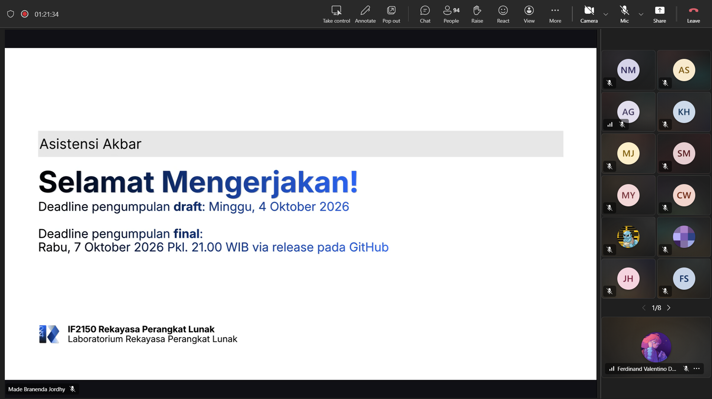

# Form Asistensi

## Tugas Besar IF2150 - Rekayasa Perangkat Lunak

| Informasi | Keterangan |
| --- | --- |
| **Hari** | *Sabtu* |
| **Tanggal** | *16/09/2026* |
| **Kelas** | *02* |
| **Nomor Kelompok** | *10*  |
| **Nama Kelompok** | *RPL at 25*  |
| **Nama Perangkat Lunak** | *SafeShe*  |
| **Dokumen** | *K02_G10_SKPL*  |

### Anggota Kelompok

| NIM | Nama |
| --- | --- |
| *13525083* | *Natanael Chris Fabian Santoso* |
| *13525131* | *Mirza Aryasatya Akmal* |
| *13525149* | *Ferdinand Valentino Darmawan* |
| *13525050* | *Jason Hartanto* |
| *13525065* | *Christopher Hendrik Gunawan* |

### Catatan

| Catatan |
| --- |
| 1. Untuk Bab 1, pattern yang dipilih disesuaikan dengan dokumen SKPL sebelumnya dan tidak perlu semua pattern dipilih. Jadi SKPL digunakan sebagai baseline final untuk milestone ini.  |
| 2. Untuk Bab 1, minimal pilih 1 pattern dari 5 pattern yang ada, dan kalau tidak cukup boleh tambah. Bagian 1 hanya menjelaskan tanggung jawab yang diberikan, lalu bagian 2 dihubungkan dengan kebutuhan pada SKPL. |
| 3. MVC bisa dipakai juga jika di Tech Stack SKPL nya menggunakan Laravel, Django. Di Layered Action itu bagian atas lebih berhubung dengan user yang di Layered Action terbagi menjadi 4 layer. Client-Server itu cocok untuk implementasi web-based application. Pipe and Filter Architecture lebih jarang digunakan dalam pengimplementasian aplikasi pada umumnya. |
| 4. Bab 2 tinggal masukin ke tabel sesuai dengan pattern yang dipakai di Bab 1. |
| 5. Selain 4 view yang ada, sebenarnya ada Skenario Use case view tapi sudah dikerjakan di milestone sebelumnya. Dari 4 jenis view, diwajibkan membuat minimal 1 architectural view yang menjelaskan dari sudut pandang berbeda untuk style yang dipilih. |
| 6. Logical view lebih fokus ke fungsionalitasnya. Salah satu diagram dari logical view adalah state machine diagram yaitu untuk menampilkan state dari sebuah objek selama hidupnya, ada 5 notasi yang digunakan di state machine diagram. |
| 7. Process view lebih fokus ke runtime, performa, jadi ketika ada bottleneck akan lebih mudah kelihatan. Salah satu diagramnya, sequence diagram akan dijelaskan lebih lanjut di milestone berikutnya. |
| 8. Development view dipakai untuk mengatur manajemen software dari sudut pandang pengembang. |
| 9. Physical view lebih fokus ke letak komponen perangkat secara fisik dalam pemetaannya perangkat lunak ke cloud / perangkat keras fisik. |

**Notes for this section:**  
*Catatan dapat dituliskan dalam bentuk paragraf atau poin-poin, disesuaikan saja.* 

## Dokumentasi

<!--  -->

  

  <i>Gambar 1. Dokumentasi kegiatan asistensi.</i>

