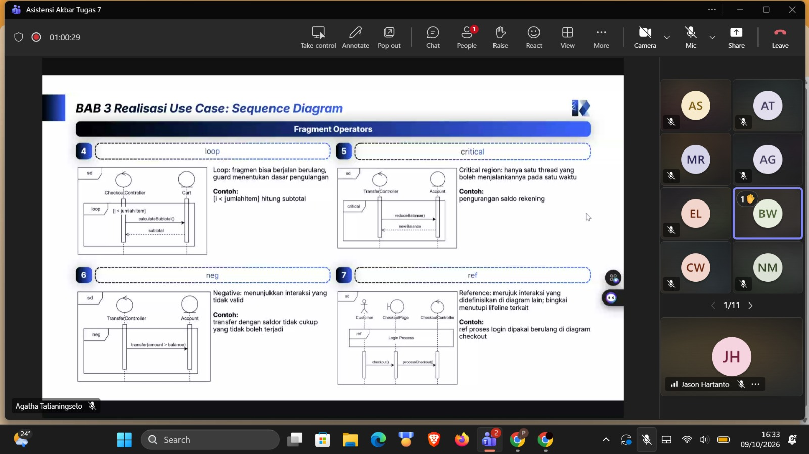

# Form Asistensi

## Tugas Besar IF2150 - Rekayasa Perangkat Lunak

| Informasi | Keterangan |
| --- | --- |
| **Hari** | *Sabtu* |
| **Tanggal** | *16/09/2026* |
| **Kelas** | *02* |
| **Nomor Kelompok** | *10*  |
| **Nama Kelompok** | *RPL at 25*  |
| **Nama Perangkat Lunak** | *SafeShe*  |
| **Dokumen** | *K02_G10_SKPL*  |

### Anggota Kelompok

| NIM | Nama |
| --- | --- |
| *13525083* | *Natanael Chris Fabian Santoso* |
| *13525131* | *Mirza Aryasatya Akmal* |
| *13525149* | *Ferdinand Valentino Darmawan* |
| *13525050* | *Jason Hartanto* |
| *13525065* | *Christopher Hendrik Gunawan* |

### Catatan

| Catatan |
| --- |
| 1. *Bab 1 bisa dicopas dari dokumen SKPL kemarin jika tidak ada perubahan. Lalu bab 1 bagian akhirnya itu paragraf 1 saja, mengenai milestone ini.*  |
| 2. *Bab 2 bagian 2 awal bisa copas dari milestone sebelumnya.* |
| 3. *Kelas perancagan itu nama kelas nanti waktu implementasi, kalau analisis itu yang kemarin dipake di diagram sebelumnya. Lalu nama antara perancangan dan analisis boleh sama maupun beda.* |
| 4. *Atribut dan method yang dimasukkan ke di diagram itu cukup yang dipake untuk use case tersebut. Karena di diagram akan dicantumkan atribut dan method nya maka tidak perlu membuat tabel lagi untuk setiap use case. Ini untuk bagian 3.1.3.* |
| 5. *Ada 6 notasi yang harus dipake di dalam diagramnya. Untuk setiap notasi dan penjelasannya ada di PPT asistensi akbar.* |
| 6. *Ada 10 macam message yang dapat digunakan dalam sequence diagram, untuk penjelasannya ada di PPT asistensi akbar.* |
| 7. *Fragment operators itu ada alt jadi dalam bentuk alternatif seperti if else, dan ini boleh lebih dari 1 kondisi juga. Lalu ada Opt itu hanya untuk kondisi yang true saja, kemudian ada Par itu semua fungsi dijalankan secara pararel. Ada juga loop, critical yang memastikan hanya satu thread dijalankan dalam satu waktu, neg itu untuk kondisi yang invalid berarti yang tidak boleh terjadi. Ada juga ref untuk seperti bagian login agar bagian yang dikerjakan di dalam ref itu ga perlu diulang-ulang terus.* |
| 8. *Bab 4 itu tidak perlu buat diagram dengan atribut dan methodnya, jadi bisa pakai diagram dari milestone sebelumnya.* |
| 9. *Bab 5 juga sudah dibuat di milestone sebelumnya, jadi bisa dicopas.* |
| 10. *Dalam satu sequence diagram boleh menggunakan lebih dari 1 fragment, bisa juga dikombinasi seperti loop di dalam loop lagi. Lalu untuk satu use case itu termasuk berbagai alternatifnya disatukan jadi 1 diagram saja.* |
| 11. *Critical region itu dipake untuk menghindari terjadinya race condition, di mana hanya mau ada 1 thread untuk melakukan suatu hal terlebih dahulu baru hal yang dimodifikasi digunakan oleh thread lain.* |  

**Notes for this section:**  
*Catatan dapat dituliskan dalam bentuk paragraf atau poin-poin, disesuaikan saja.* 

## Dokumentasi

<!--  -->

  

  <i>Gambar 1. Dokumentasi kegiatan asistensi.</i>

